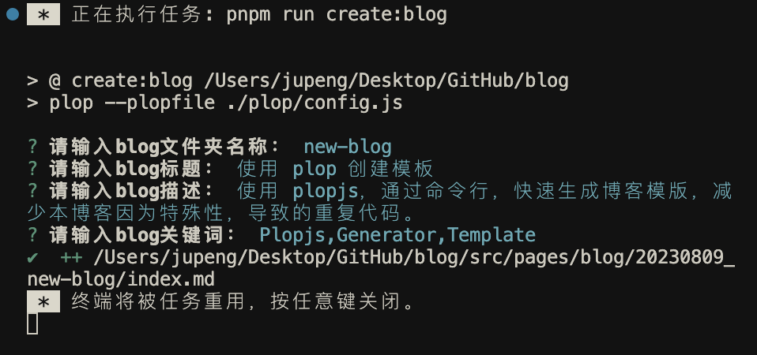

<route lang="yaml">
meta:
  title: 使用 Plop 生成模板
  desc: 使用 plopjs，通过命令行，快速生成博客模版，减少本博客因为特殊性，导致的重复代码。
  keywords: [Plopjs, Generator, Template]
  date: 2023-06-30 21:30:59
</route>

# 使用 Plop 生成模板

由于本博客文章的特殊编写模式，会有两段类似结构，仅作用不同，每次都要写两遍，使用 plop 提前设置好格式，在命令行仅需补充字段即可。

## 起因

本博客采用 markdown 为主要编写格式，想要打包后生成的`html`文件，能够有单独的 title 、description 和 keywords，需要在 markdown 文件头部添加一段 特殊代码，如下：

```markdown
---
title: 使用 plop 生成模板
meta:
  - name: description
    content: 使用 plop，通过命令行，快速生成博客模版，减少本博客因为特殊性，导致的重复代码。
  - name: keywords
    content: Plop, Generator, Template
---
```

但是在逻辑中，想要在`列表页中`，展示出文章的 title 、description、 keywords 和 date 等，则需要在 markdown 文件头部添加一段路由信息，如下：

```vue
<route lang="yaml">
meta:
  title: 使用 plop 生成模板
  desc: 使用 plop，通过命令行，快速生成博客模版，减少本博客因为特殊性，导致的重复代码。
  keywords: [Plop,Generator,Template]
  date: 2023-06-30 21:30:59
</route>
```

这两段代码，仅仅是作用不同，但是结构相同，每次都要写两遍，所以想要通过`plop`，通过命令行，快速生成博客模版，减少本博客因为特殊性，导致的重复代码。

## 什么是 Plop

简单来说`Plop`就是是一个小型的、零依赖的、可编程的代码生成器，可以通过命令行，快速生成代码，减少重复代码。详情介绍可以参考[What is Plop?](https://plopjs.com/documentation/#what-is-plop)。

## 安装 Plop

```bash
pnpm add plop -D
```

## 创建 Plop 目录与 npm script

### 目录结构

以本博客为例，在项目根创建如下目录结构：

```bash
├── plop
│   ├── blog
│   │   └── index.md.hbs
│   └── config.js
```

其中 `config.js` 是 plop 的配置文件，`blog` 目录下 `index.md.hbs` 是模版文件，`.hbs` 是`handlebars`的后缀，`handlebars`是一个简单的模版语言，可以通过`{{}}`来插入变量，`{{#if}}`来判断条件，`{{#each}}`来遍历数组等，具体语法可以参考 [handlebars.js](https://handlebarsjs.com/)。

### npm script

在`package.json`中的`scripts`添加如下命令：

```json
{
  "scripts": {
    "create:blog": "plop --plopfile ./plop/config.js"
  }
}
```

## 配置 Plop config 文件

在`plop/config.js`中，添加如下代码：

```js
export default function (
  /** @type {import('plop').NodePlopAPI} */
  plop,
) {
  const today = '2023-06-30'

  plop.setHelper('date', () => {
    return '2023-06-30 21:30:59'
  })

  // 创建博客模版命令
  plop.setGenerator('blog', {
    description: '创建一个blog：',
    prompts: [
      {
        type: 'input',
        name: 'fileName',
        message: '请输入blog文件夹名称：',
      },
      {
        type: 'input',
        name: 'title',
        message: '请输入blog标题：',
      },
      {
        type: 'input',
        name: 'desc',
        message: '请输入blog描述：',
      },
      {
        type: 'input',
        name: 'keywords',
        message: '请输入blog关键词：',
      },
    ],
    actions: [
      {
        type: 'add',
        path: `../src/pages/blog/${today}_{{fileName}}/index.md`,
        templateFile: './blog/index.md.hbs',
        data: {
          title: '{{title}}',
          desc: '{{desc}}',
          keywords: '{{keywords}}',
        },
      },
    ],
  })
}
```

### setHelper

`setHelper`用来注册一个`handlebars`的 helper，可以在模版中使用，你也可以进行传参数，进行动态的渲染：

```js
plop.setHelper('upperCase', txt => txt.toUpperCase())
```

> 更多请查看：[setHelper](https://plopjs.com/documentation/#sethelper)。

### setGenerator

`setGenerator` 方法用于定义生成器（generator）。生成器是 Plop 框架的核心概念之一，它允许您创建可重复使用的代码生成模板。下面是 `setGenerator` 方法的详细说明：

```js
plop.setGenerator(name, config)
```

- `name`：生成器名称，用于标识生成器。在运行 Plop 时，您将使用这个名称来选择特定的生成器。
- `config`：生成器的配置对象，包含以下属性：
  - `description`：生成器的描述，可以提供一些关于生成器目的的信息。
  - `prompts`：用户提示的数组，每个提示定义了一个用户输入的信息。提示可以包括以下属性：
    - `type`：提示类型，可以是 'input'、'confirm'、'list' 等，取决于需要的用户输入类型。
    - `name`：提示名称，用于在模板中引用用户输入的值。
    - `message`：提示用户的消息，说明用户应该提供什么样的信息。
  - `actions`：生成器运行时要执行操作任务数组。每个操作可以包括以下属性：
    - `type`：操作类型，可以是 'add'、'modify'、'append' 等，取决于对生成文件进行的操作。
    - `path`：生成文件的路径，可以是相对路径或绝对路径。
    - `templateFile`：模板文件的路径，用于根据用户输入和模板生成最终的文件内容。

> 更多请查看：[setgenerator](https://plopjs.com/documentation/#setgenerator)

## 配置模版文件

在`plop/blog/index.md.hbs`中，添加如下代码：

```hbs
---
title: {{ title}}
meta:
  - name: description
    content: {{ desc }}
  - name: keywords
    content: {{ keywords }}
---

<route lang="yaml">
meta:
  title: {{ title}}
  desc: {{ desc}}
  keywords: [{{ keywords }}]
  date: {{ date }}
</route>

# {{ title}}
  {{ desc }}
```

可以看到，我们在模版中使用了`handlebars`的语法，`{{ title}}`、`{{ desc }}`、`{{ keywords }}`都是通过用户输入的值来进行渲染的，date 是通过`setHelper`注册的 helper 方法来进行渲染的。

本次 `setHelper`注册的 helper 方法 未使用到参数，若需要传递参数，可以这样写：

```js
plop.setHelper('fn', (text) => {
  return text.toUpperCase()
})
```

然后在模版中使用：

```hbs
{{ fn 'hello world' }}
```

生成的结果为：

```text
HELLO WORLD
```

## 运行 Plop 命令



## 完整 Plop 文档查阅

> 官方文档：[plopjs](https://plopjs.com/documentation)
