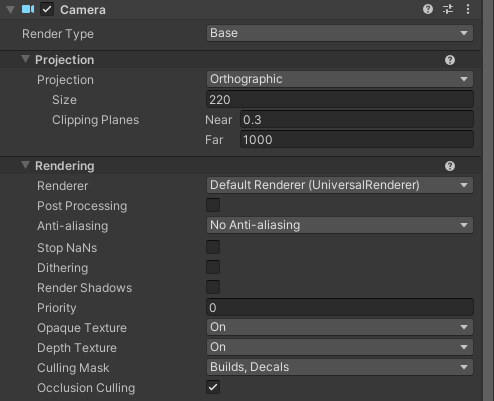

<route lang="yaml">
meta:
  title: Unity 中实现小地图
  desc: 最近在做一个 VR 项目，由于地图场景有很多个，并且具有一定规模，需要一个小地图来指引用户所在位置
  keywords: [Unity,MiniMap,VR ]
  date: 2023-08-15 21:40:33
</route>

# unity 中实现小地图

  最近在做一个 VR 项目，由于地图场景有很多个，并且具有一定规模，需要一个小地图来指引用户所在位置。
  
  利用 Unity 的 `Camera` 渲染到 `RenderTexture`，然后将 RenderTexture 作为材质贴图，渲染到 `RawImage` UI 上，就可以实现小地图功能，接下来就是具体的实现过程。

## 1. 创建小地图相机

在 Unity 中创建一个新的相机，设置好相机的位置和旋转，设置为相机的 `Projection 为 Orthographic`，设置好相机的 `Size`，这个值决定了相机的视野大小，也就是小地图的大小。然后设置相机的 `Culling Mask`，只渲染地图层，不渲染其他层，这样就可以只渲染地图了。当然你可也根据自己的需求， 去设置需要渲染的层。



## 2. 创建 RenderTexture

这一步有两种方式，一种是在代码中创建，一种是在 Unity 中创建，我这里使用的是在代码中创建，代码如下：

```csharp
// 创建 RenderTexture，1000 为宽度，1000 为高度，0 为深度
RenderTexture rt = new RenderTexture(1000, 1000, 0);

// 设置相机的 TargetTexture 为 rt
camera.targetTexture = rt;
```

## 3. 创建一个 RawImage

创建一个 `小地图Canvas`，宽高与上一步创建的RenderTexture相同，使用缩放将物体缩放到游戏中合适的大小， 创建一个子物体 `RawImage`，然后将上面创建的 RenderTexture 赋值给 RawImage 的 `Texture` 属性，这样就可以将相机渲染的内容显示到 RawImage 上了。

```csharp
// 将 RenderTexture 赋值给 RawImage 的 Texture 属性
rawImage.texture = rt;
```

## 4. 计算缩放比例

在第一步中设置了 `Size`，这个值决定了相机的视野大小，也就是小地图的大小，所以在第四步中，在赋值时，我们需要计算坐标的缩放比例：

```csharp
// 计算缩放比例，除以二是因为相机的 Size 是相机视野的一半
scale = size / camera.orthographicSize / 2;
```

## 5. 展示玩家位置

在 `小地图Canvas` 中创建一个位置图标，用来显示玩家的位置，然后将脚本挂载到玩家身上，在 `Update` 方法中，计算玩家与相机的相对位置，然后将比较后的位置赋值给位置图标的 `localPosition` 属性，这样就可以实现玩家位置的实时更新了。

```csharp
// 将玩家的位置与相机的位置进行比较
Vector3 pos = transform.position - camera.transform.position;

// 将比较后的位置赋值给位置图标的 localPosition 属性
positionImage.localPosition = new Vector3(pos.x / size, pos.z / size, 0);
```

> 在第一步中设置了 `Size`，这个值决定了相机的视野大小，也就是小地图的大小，所以在第四步中，在赋值时，我们需要计算缩放比例，如果我们的 `Size` 为 

## 6. 核心代码

```csharp
using QFramework;
using UnityEngine;
using UnityEngine.UI;

public class MiniMap : Controller
{
    [Header("小地图相机")] public Camera camera;
    [Header("小地图渲染图片")] public RawImage rawImage;
    [Header("小地图位置图标")] public  Transform positionImage;

    int size = 1000; // 小地图大小
    float scale; // 缩放比例

    void Start()
    {
        // 创建 RenderTexture，1000 为宽度，1000 为高度，0 为深度
        RenderTexture rt = new RenderTexture(size, size, 0);

        // 设置相机的 TargetTexture 为 rt
        camera.targetTexture = rt;

        // 将 RenderTexture 赋值给 RawImage 的 Texture 属性
        rawImage.texture = rt;

        // 计算缩放比例，除以二是因为相机的 Size 是相机视野的一半
        scale = size / camera.orthographicSize / 2;
    }

    void Update()
    {
        // 将玩家的位置与相机的位置进行比较
        Vector3 pos = transform.position - camera.transform.position;

        // 将比较后的位置赋值给位置图标的 localPosition 属性
        positionImage.localPosition = new Vector3(pos.x / size, pos.z / size, 0);
    }
}
```
