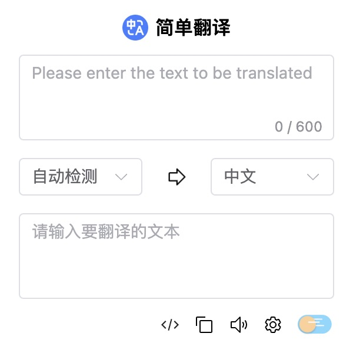
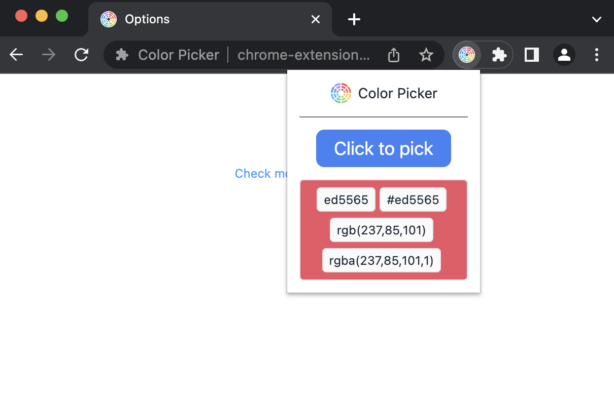
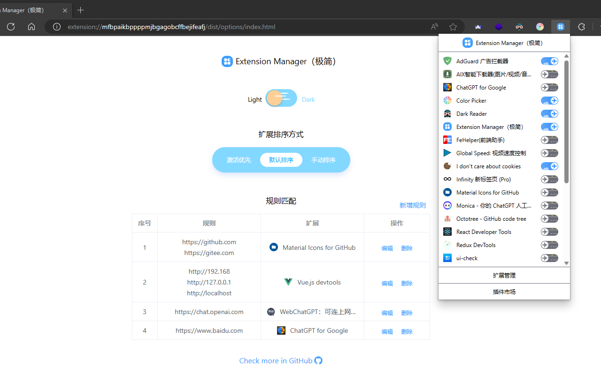

<route lang="yaml">
meta:
  title: 自己开发的浏览器插件
  desc: 介绍一下自己开发的浏览器插件，使用人数终于突破600人次了。
  keywords: [Browser, Web Extensions]
  date: 2023-08-20 20:44:32
</route>

# 自己开发的浏览器插件

介绍一下自己前段时间开发的浏览器插件，一个是用于简单翻译的[Simple Translator（简译）](https://microsoftedge.microsoft.com/addons/detail/idejokphbhcbdjpibgibjppmolnmdlkj?hl=zh-CN)，一个是用于取色的[Color Picker](https://microsoftedge.microsoft.com/addons/detail/kdalomkmijnajhdenobbpjckagnmgmdg?hl=zh-CN)，一个是用于管理扩展的[Extension Manager（极简）](https://microsoftedge.microsoft.com/addons/detail/pfiggkflfkhohkmegglgnlgakdbmjdfh?hl=zh-CN)，这三个都已经上架`Edge浏览器`的插件商店了，累计使用人数终于突破`600`余人次啦😃。

## 我的插件
### 1、Simple Translator（简译）

对于我这种英语渣渣来说，经常需要用到`翻译`，但是要去翻译的时候操作步骤太多了，还不想仅因为一个翻译去搞个软件使用，就想到了开发个简易的翻译插件使用，此插件非常简洁，提供以下功能：

- 开启插件`自动聚焦`到输入框，输入内容后`自动翻译`、`自动复制`
- 支持英文译文的多种`命名`规范，如：`驼峰`、`常量`、`下划线`等
- 支持`朗读`、提供`黑暗模式`

#### 1.1 食用方式

对于前端开发者，浏览器基本只要电脑开着，他就一直开着，因此步骤非常简单：

> 点击插件图标 -> 输入内容 -> 此时已经自动翻译并复制到剪贴板 -> 粘贴使用

你可以在设置里面设置一些参数，如：`默认命名规则`、`自动复制`、`朗读`、`百度翻译设置`等，手动复制时默认提供的，此外还提供了临时的命名转换按钮。

#### 1.2 百度翻译设置

> 1. 前往百度翻译开放平台：[https://fanyi-api.baidu.com](https://fanyi-api.baidu.com/)。
> 2. 登陆或注册账号。
> 3. 点击顶部`产品服务`，选择`通用文本翻译`，点击`立即使用`。
> 4. 选择`个人开发者`，按提示输入剩余信息，点击`下一步`。
> 5. 会提示进行身份认证，最好认证一下，翻译次数会多很多。
> 6. 认证后，返回上一页，点击顶部`管理控制台`，选择`总览`，点击`立即开通`。
> 7. 选择`通用文本翻译`，点击`下一步`。
> 8. 如果你进行了第5步，就选择`开通高级版`，输入应用名称，点击`提交`。
> 9. 返回总览，底部会有`APP ID`和`密钥`，将其填入插件设置中即可。

### 2、Color Picker

插件商店中用了很多，发现没有一个好用的`取色插件`，而且多数取色插件都比较臃肿，所以就自己开发了一个，这个插件的特点是：`简单、轻量、快速`，没有其他多余的功能，只有取色功能，取色时会自动将颜色值复制到`剪贴板`，方便直接粘贴使用，并且可以在`非浏览器窗口`使用。

### 3、Extension Manager（极简）

插件过多时就需要一款`插件管理器`，同样的我发现多数插件管理器都比较繁琐，还不好看，所以就自己开发了一个，提供了插件的、`启用`、`禁用`、`卸载`、`排序`、`匹配`等功能，没有其他的额外操作，仅在一个面板上即可完成所有操作：

> 1. 支持扩展启用、禁用、卸载（双击扩展图标）。
> 2. 支持三种排序方式，默认排序、激活优先、手动排序（点击扩展图标拖拽进行排序）。
> 3. 支持点击扩展名称进入扩展配置界面。
> 4. 提供与扩展管理相同快捷按钮：管理扩展、扩展商店。
> 5. 提供两种主题，浅色、深色。
> 6. 提供规则匹配，根据当前打开网站，自动启用与禁用扩展。

## 插件项目地址

以上插件都可以在我的`GitHub`上找到源码：

> 1. [Simple Translator（简译）](https://github.com/AnthonyJu/webext-simple-translator)
> 2. [Color Picker](https://github.com/AnthonyJu/webext-color-picker)
> 3. [Extension Manager（极简）](https://github.com/AnthonyJu/webext-minimalism-extension-manager)

## 非Edge浏览器使用

谷歌浏览器是肯定没问题的跟Edge应该是一样的，其他浏览器没有测试过，再就是如果要在其他浏览器使用，包括谷歌浏览器，需要自己添加，因为谷歌商店的开发者需要花软妹币，而且需要绑定国外银行卡。具体操作如下

> 1. 下载解压：[Simple Translator（简译）](https://raw.githubusercontent.com/AnthonyJu/static/main/simple-translator/extension.zip)、[Color Picker](https://raw.githubusercontent.com/AnthonyJu/static/main/color-picker/extension.zip)、[Extension Manager（极简）](https://raw.githubusercontent.com/AnthonyJu/static/main/minimalism-extension-manager/extension.zip)
> 2. 打开浏览器设置，找到`扩展程序`，打开`开发者模式`。
> 3. 点击`加载已解压的扩展程序`，选择解压后的文件夹即可。

## 潜在问题及后续

哈哈哈哈哈， `Color Picker`应该没啥问题，我还想好了一个优化使用的地方，等后续有时间有心情再弄吧。`Extension Manager（极简）`常用功能没有，匹配这个有个问题点，有时会出现匹配失败的情况，这个后续再看看吧，多数情况下正常浏览都没啥问题，如果有人反映的话，我就尽快修复，没有人反应的话，我就emmmmm放一放😂。
