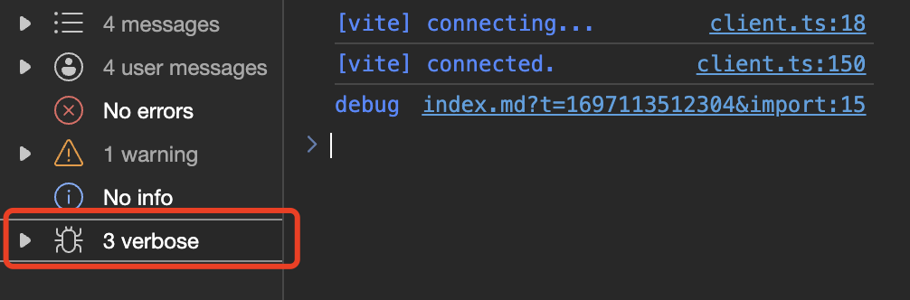
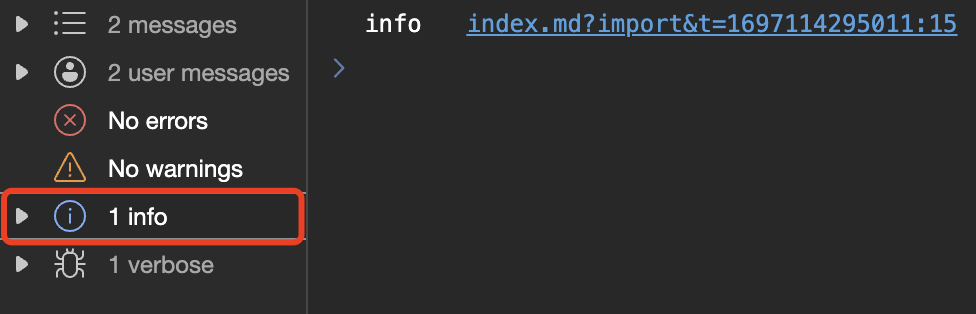
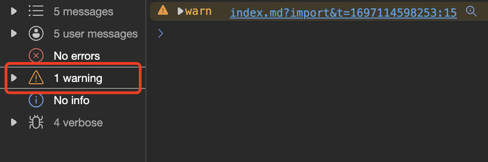
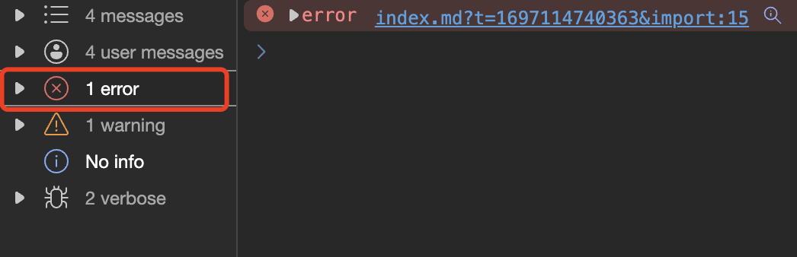
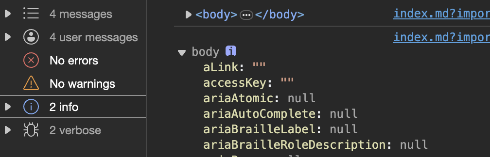
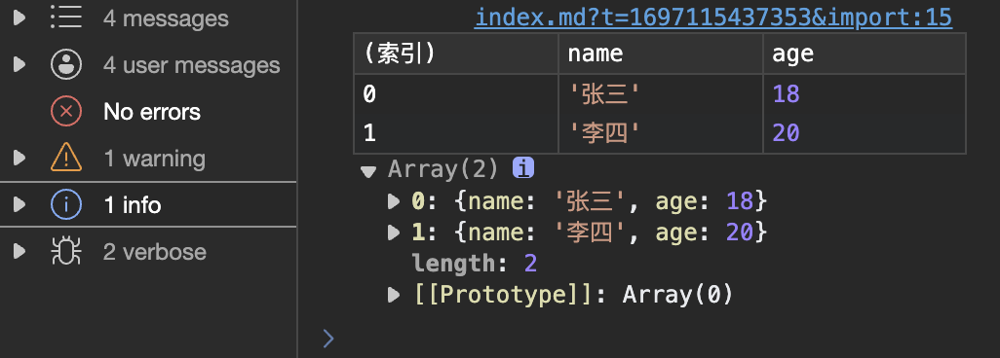
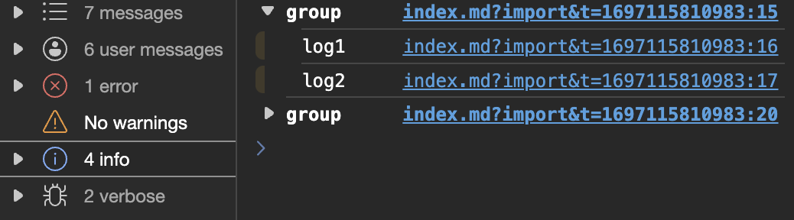
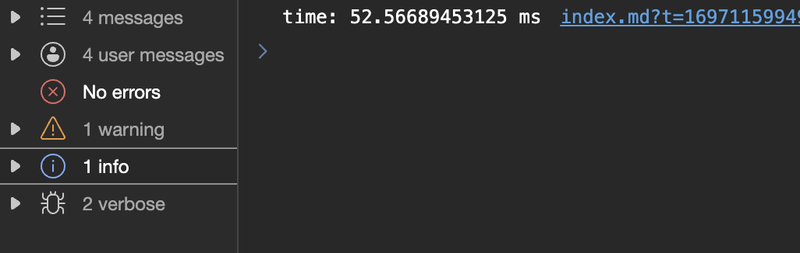
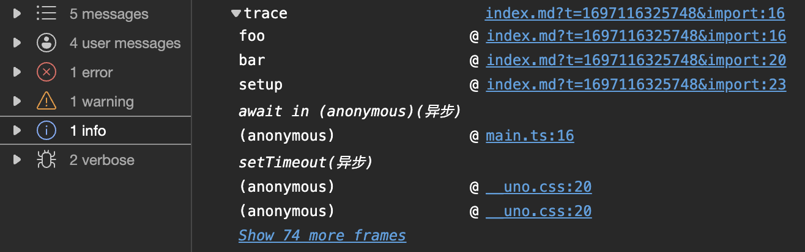
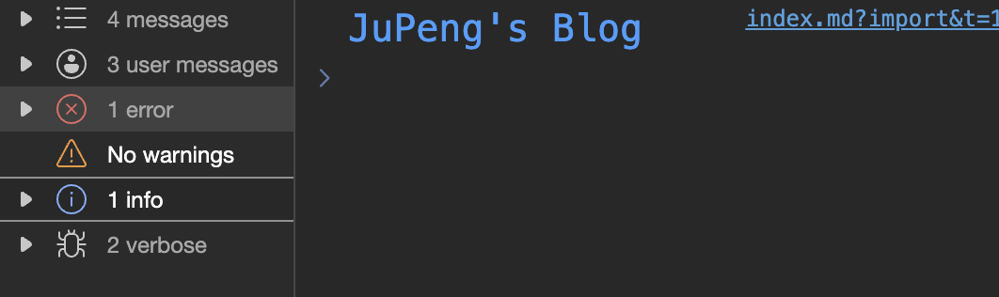

<route lang="yaml">
meta:
  title: 你不知道的Console
  desc: JS 中的 Console 不仅仅只有 log，还有很多好用的功能，本文将介绍一些常用的功能。
  keywords: [JS, Console]
  date: 2023-09-01 20:14:06
</route>

# 你不知道的Console

JS 中的 Console 不仅仅只有 log，还有很多好用的功能，本文将介绍一些常用的功能。

## 1. 打印调试 debug

```js
console.debug('debug')
```

作用跟 `console.log` 差不多，只是在控制台中显示不一样，其类型属于 `verbose`：



## 2. 打印消息 log

```js
console.log('log')
```

这个是最常用的，打印普通的消息，无图😬。

## 3. 打印信息 info

```js
console.info('info')
```

还是跟 `console.log` 差不多，只是在控制台中显示不一样，其类型属于 `info`：



## 4. 打印警告 warn

```js
console.warn('warn')
```

打印警告信息，其类型属于 `warning`，一般会显示为`整体黄色`并且开头显示`❕`：



## 5. 打印错误 error

```js
console.error('error')
```

打印错误信息，其类型属于 `error`，一般会显示为`整体红色`并且开头显示`❌`：



## 6. 打印对象 dir

```js
console.dir(document.body)
```

当我们去打印一个 DOM 时，`console.dir` 可以打印 DOM 元素的详细信息，而 `console.log` 则只会打印出 DOM 元素的 HTML 结构：



> 不仅仅是 DOM 元素，其他对象也可以使用 `console.dir` 打印出详细信息，如函数、数组、对象等。

## 7. 打印表格 table

```js
console.table([{ name: '张三', age: 18 }, { name: '李四', age: 20 }])
```

`console.table` 可以将数组或对象以表格的形式打印出来：



## 8. 打印分组 group

```js
console.group('group') // 默认展开
console.log('log1')
console.log('log2')
console.groupEnd()

console.groupCollapsed('groupCollapsed') // 默认折叠
console.log('log1')
console.log('log2')
console.groupEnd('groupCollapsed')
```

`console.group` 和 `console.groupCollapsed` 可以将打印的内容分组，`console.groupEnd` 则是结束分组：



## 9. 打印计时 time

```js
console.time('time')
// eslint-disable-next-line no-empty
for (let i = 0; i < 100000000; i++) {}
console.timeEnd('time')
```

`console.time` 和 `console.timeEnd` 可以计算代码的执行时间：



## 10. 打印堆栈 trace

```js
function foo() {
  console.trace('trace')
}

function bar() {
  foo()
}

bar()
```

<script setup>

</script>

`console.trace` 可以打印当前的堆栈信息，就是当前代码的调用栈，可以用来追踪代码的执行过程，比如上面的代码，我们可以看到 `trace` 的调用栈是 `foo -> bar`：



## 11. 清空消息 clear

```js
console.log(1)
console.clear()
console.log(2)
```

`console.clear` 可以清空控制台的消息，方便我们查看最新的消息：


## 12. 添加样式 style

```js
console.log('%cHello World', 'color: #309eff; font-size: 20px;')
```

`console.log` 可以添加样式，只需要在第一个参数中添加 `%c`，后面的参数就是样式，当然你也可以提前定义好样式，然后将其传入第二个参数中：


