<route lang="yaml">
meta:
  title: 创建 VR（URP）启动模板
  desc: 使用 Unity 创建一个 通用渲染管线（URP）的 VR 启动模板，方便后续开发使用。
  keywords: [Unity, VR, URP]
  date: 2023-09-12 20:21:45
</route>

# 创建 VR（URP）启动模板

记录一下如何创建一个URP类型的VR项目。

## 一、基础环境

### 1. 新建 3D（URP）

在 Unity Hub 中选择`3D（URP）`核心模板进行创建：

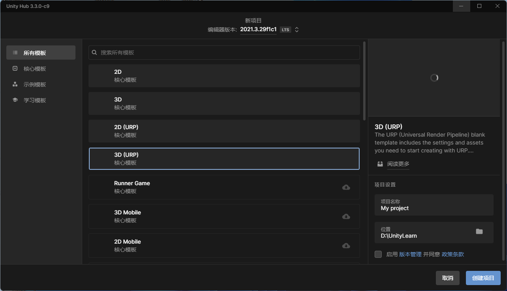

### 2. 安装 XR Plugin Management

在工具栏中找到`Window -> Package Manager`，将左上角的资源来源改为`Unity Registry`，并在左侧搜索`XR Plugin Management`，点击右下角`install`:

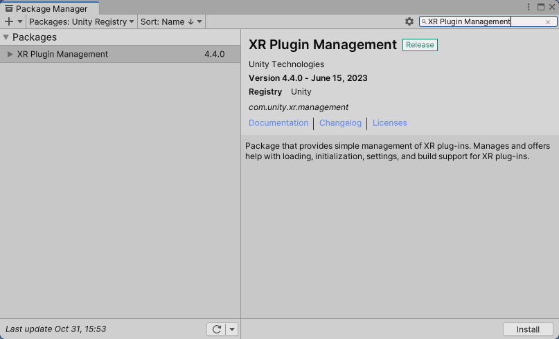

### 3. 安装 Steam VR

前往[Unity Assets Store Steam VR](https://assetstore.unity.com/packages/tools/integration/steamvr-plugin-32647)，登录后`添加至我的资源`。

回到Unity，将资源来源改为`My Assets`，选择`Steam VR Plugin`，点击坐下角`Download`，然后点击`Import`：

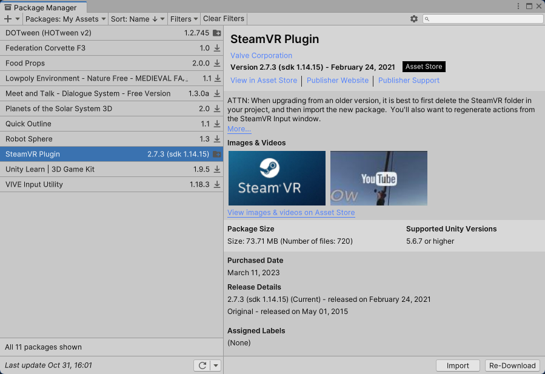

之后会弹出 Steam VR Plugin 的导入弹窗，点击左下角`Import`:

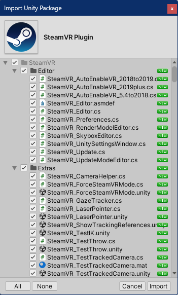

点击`OK`：

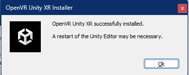

点击`Accept All`

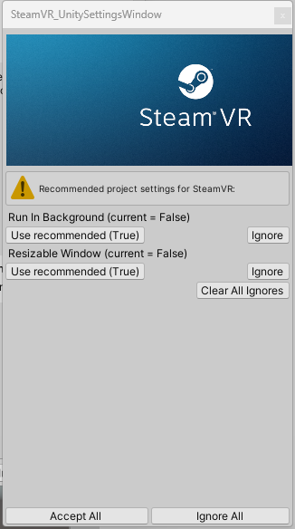

到这里最好重启一下Unity。

重启后在工具栏中找到`Edit -> Project Settings`，选择底部的`XR Plugin Management`，如果没有选中`OpenVR Loader`，点击选中：

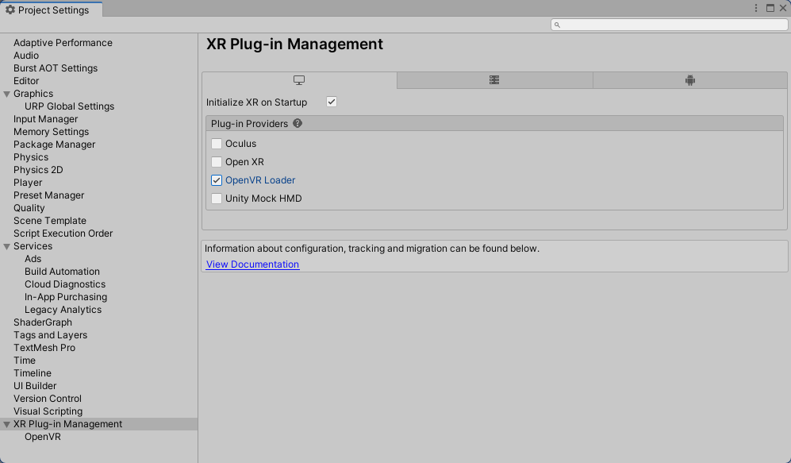

### 4. 配置 SteamVR Input

工具栏中找到`Window -> SteamVR Input`：

点击`YES`:

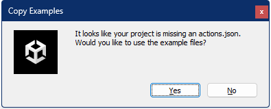

点击`Save`：

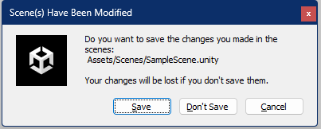

### 5. 添加 Player

删除`Hierarchy`中的`Main Camera`:

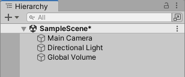

在`Project`中搜索`Player`，将其预制体拖至`Hierarchy`：

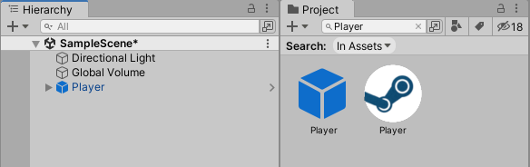

### 6. 修改 Shader

如果后续是自定义制作VR手部或手柄等，这里可以不改。

由于采用的是 URP，SteamVR 默认不是 URP，因此需要重新设置一下`Shader`，以右手套为例：

将`Shader`改为`Universal Render Pipeline / Lit`:

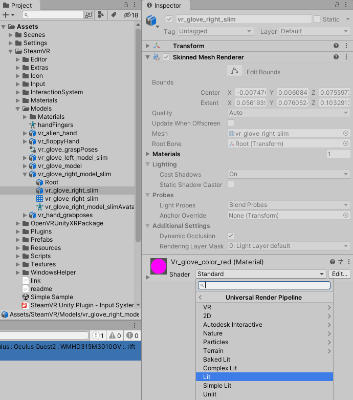

展开此材质，将`Surface Inputs`中的`Base Map`改为，当前文件夹`Materials`下的`vr_globe_color_red`:

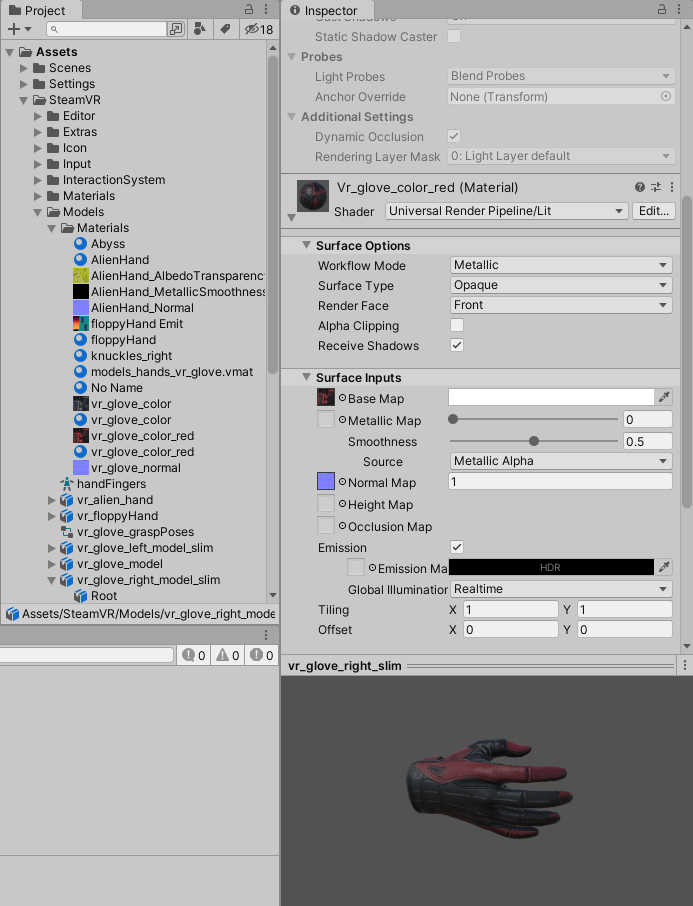

### 7. 运行测试

在运行前，随便添加两个参照物`Plane`和`Cube`，点击运行：

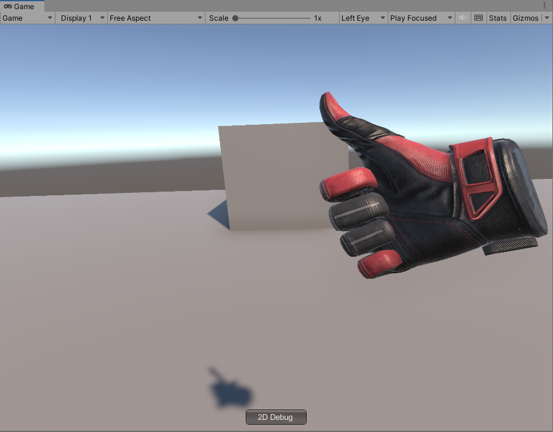

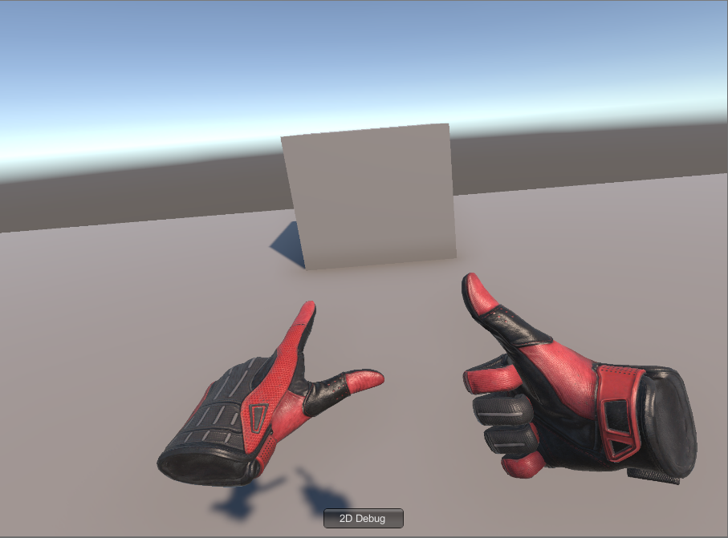

## 二、房间设置

你需要先下载Steam，从Steam中安装Steam VR这款软件，当你启动VR项目时，Unity会自动启动Steam VR，根据自己的设备连接到Steam VR：

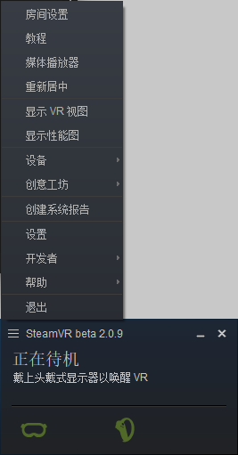

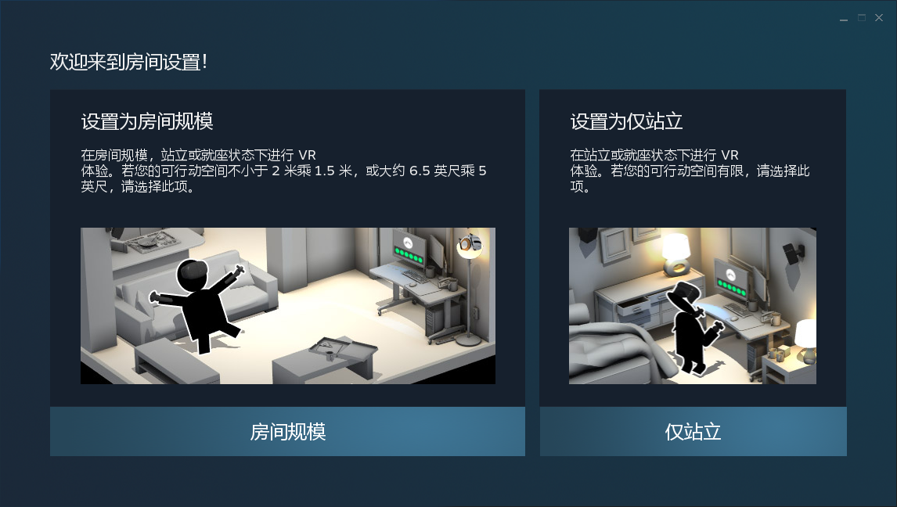

进入房间设置，根据你的情况选择房间设置，然后进行头盔校准：
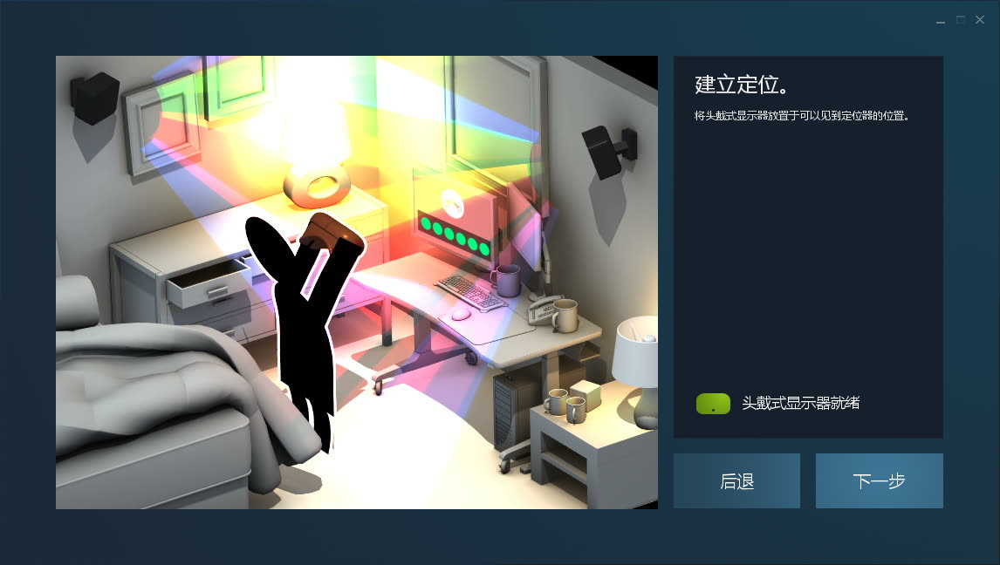

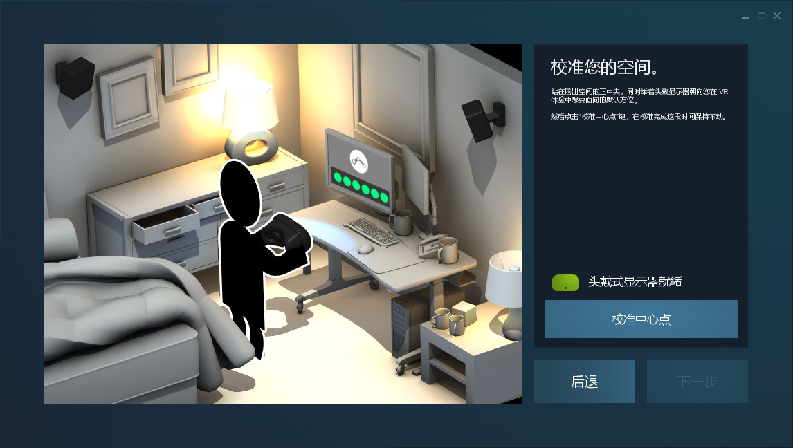

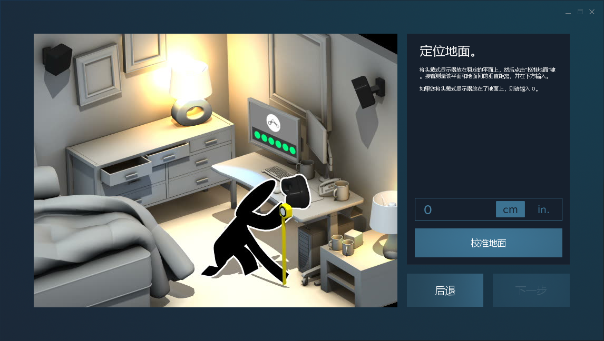

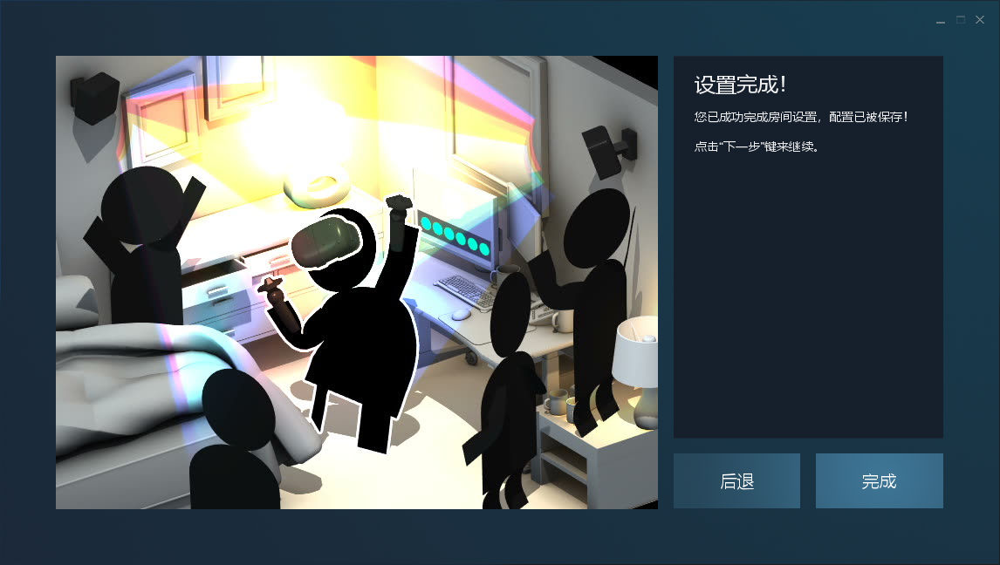

## 三、常用插件

### 1. DOTween

前往[Unity Assets Store DOTween](https://assetstore.unity.com/packages/tools/animation/dotween-hotween-v2-27676)登录后`添加至我的资源`。

回到Unity`Window -> Package Manager`,将资源来源改为`My Assets`，选择`DOTween`，点击右下角`Download`，然后点击`Import`：

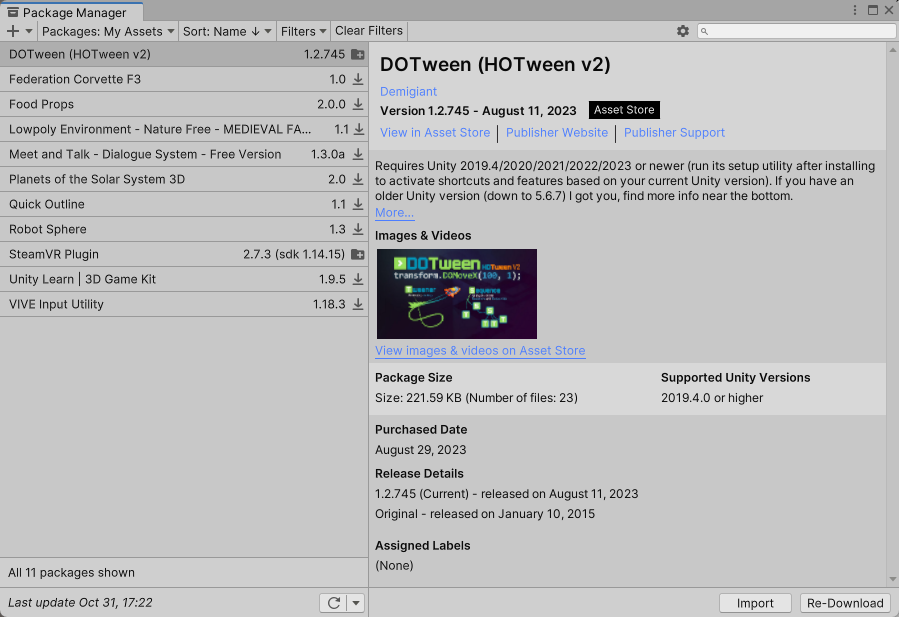

### 2. QFramework

一个Unity开发框架，前往[QFramework](https://gitee.com/liangxiegame/QFramework)的仓库，滑动到下方点击下载：

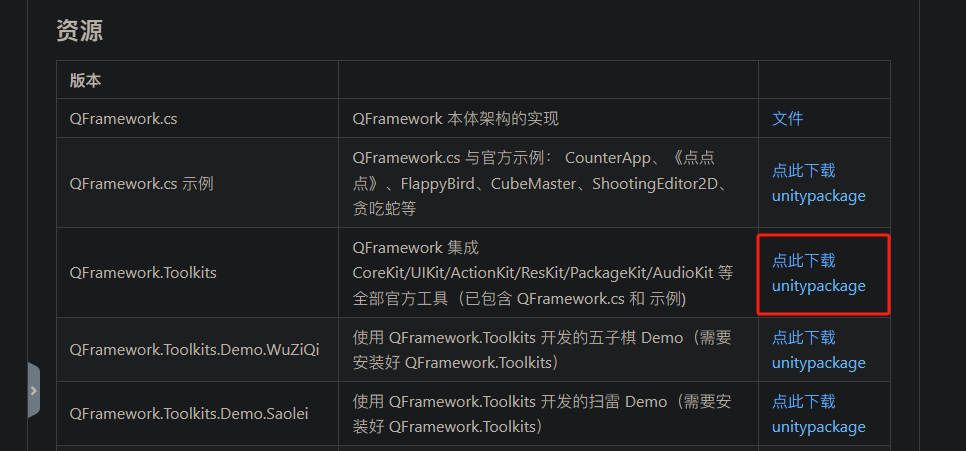

下载后直接放到，项目`Assets`目录下，找到`QFramework.cs`，在编辑器打开，找到`Controller`，为其继承增加`ICanSendEvent`：

```cs
public interface IController : IBelongToArchitecture, ICanSendCommand, ICanGetSystem, ICanGetModel,ICanRegisterEvent, ICanSendQuery, ICanGetUtility, ICanSendEvent
{
}
```

### 3. HKUnityTools

来学习的隔壁公司自己整理的一些常用的Unity工具，前往[HKUnityTools](https://gitee.com/JingChanChangFan/hk_-unity-tools)的仓库，下载代码Zip包，解压后将目录`Assets`下的`HKTools`放到项目的`Assets`目录下即可。

## 四、基础脚本

写好一些基础脚本，方便后续开发使用，存在了[GitHub](https://github.com/AnthonyJu/_Scripts)，下载zip包解压后，放到项目的`Assets`目录下即可。

## 五、3D 项目和 URP 项目区别

二者之间主要是`渲染管线的不同`。`3D`项目使用的是旧的管线，即`Build in`渲染管线；而`URP`使用的是新的管线。再通俗一点地说，在两种工程里面的`shader`使用的语言不同，`Build in`管线是`CG`语言，而`URP`是`HLSL`语言。

URP项目相对于传统的渲染管线，有以下优势：

1. 更高的性能：URP项目使用了轻量级渲染管线，可以更好地利用现代硬件的性能，提供`更高的帧率`和`更短的渲染时间`。
2. 更好的跨平台支持：URP项目设计时考虑了跨平台支持，可以在多个平台上运行，包括`PC`、`移动设备`、`VR和AR`等。
3. 更容易扩展：URP项目提供了`可扩展`的渲染管线，可以轻松地添加`自定义`的效果和功能。
4. 更易于使用：URP项目提供了`更简单的材质和光照`设置，可以更快速地创建和调整场景。

总之，URP项目是一个更现代化、更高效、更易于使用和扩展的渲染管线，适用于需要更高性能和更好跨平台支持的项目。
