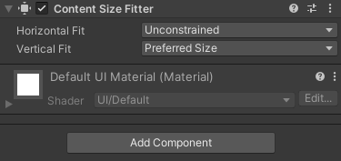

<route lang="yaml">
meta:
  title: Unity 中 Button 自适应内容
  desc: 让 Unity 中 的Button组件，能够根据Text文本内容的多少来进行自适应宽高变化。
  keywords: [Unity, Button, Adaptive Content]
  date: 2023-09-12 20:21:45
</route>

# Unity 中 Button 自适应内容

场景：玩家对话过程中会产生问题，但回答的内容是多变且不固定的，其父物体都是Button，内容长度不一，因此需要承载回答的Button需根据内容的长度和高度来进行自适应。

## 具体实现
1. 给Text添加一个 `Content Size Fitter` 组件，如果你想Button的高随着Text变化，那就设置 `Vertical Fit` 为 `Preferred Size`，高度随着变化，那就设置 `Horizontal Fit` 为 `Preferred Size`。



2. 给Button添加一个AutoSize脚本，内容如下：

```cs
using UnityEngine;
using UnityEngine.UI;

public class Env_AutoSizeCtrl : MonoBehaviour
{
  public RectTransform textRect; // 需要跟随变化的Text

  void Start()
  {
    // 重建Text布局
    LayoutRebuilder.ForceRebuildLayoutImmediate(textRect);
    // 高度固定40，宽度随Text变化
    GetComponent<RectTransform>().sizeDelta = new Vector2(textRect.sizeDelta.x + 30, 40);
  }
}
```

## 注意事项
> - Text的RectTransform组件，不要设置相关的 `stretch`
> - 如果你的Text文字内容是后期动态设置的，那么AutoSize脚本的执行，或者说`Start`下的这两行代码，就需要在动态设置文字后进行
