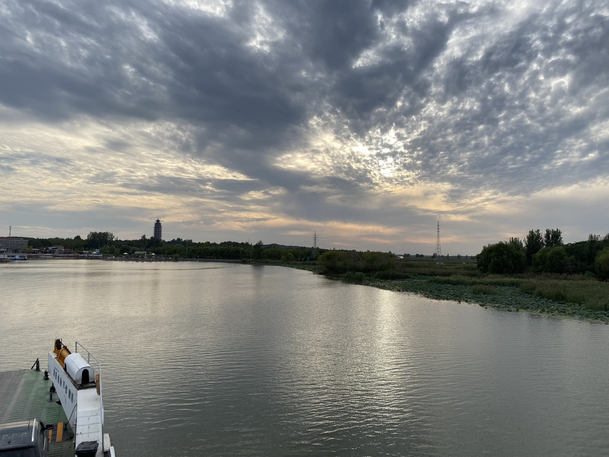
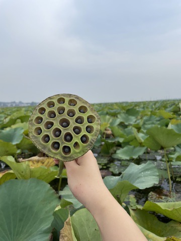
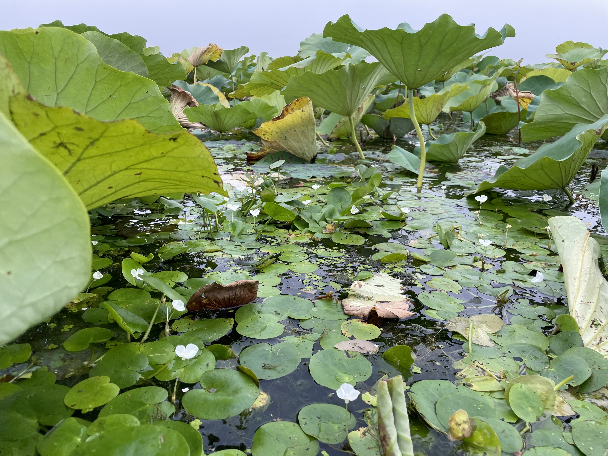
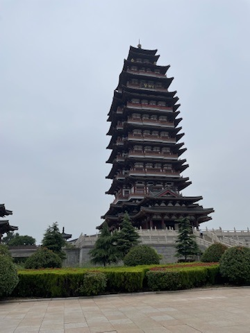
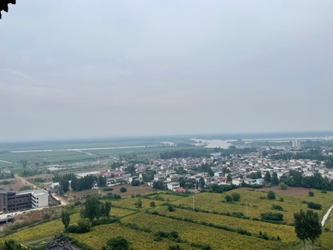

<route lang="yaml">
meta:
  title: 微山湖团建
  desc: 好久没有团建了，终于迎来公司的团建，这次去的是微山湖🪷，总共就一天😂。
  keywords: [微山湖, 团建, 生活]
  date: 2023-09-24 11:19:17
</route>

# 微山湖团建

好久没有团建了，终于迎来公司的团建，这次去的是[微山湖](https://surl.amap.com/5GKogzVu8cs)🪷，总共就一天😂。

## 准备

这次我带对象一起去，她请了一天假😬，由于我最近没在公司工作，是在其他地方，所以周五上午就晚去会公司了，睡到了9点多11点才到公司，吃完午饭就出发了🤪。

## 在路上

来自济宁的同事一路驱车，我和对象坐在后面，一路上看着风景😊，聊着天，还睡了一会儿，在服务区停住休息了一会儿，还比领导的车早到了（他们没休息）🤣，大概在下午5点到的。

## 到达目的地

我们要上岛，今晚在岛上住民宿，但是上岛需要轮渡⛴️，第一次体验做汽车，汽车坐轮船。上岛后，我们先去了民宿🏡，放下行李，民俗老板用旅游车带我们参观了一圈，然后天渐渐暗了，伴随着一些不知名的飞鸟有一种古代诗词的感觉🤩：落霞与孤鹜齐飞，秋水共长天一色。就去回去吃饭，吃了当地的大闸蟹、湖里的小鱼小虾、还有水草丸子😬，吃完饭就去了湖边，看了一会儿湖，然后回民宿休息了。

在轮渡上拍了张美景：

## 采莲蓬

一早起来，吃完早饭，就去了湖边，找了几个本地的三无😂农家船，去采莲蓬，跟三有的区别就是，可以去荷叶🪷区域，而且可以自己采摘莲蓬。随着大爷的小木船🛶，一路上看着美景，感觉很不错，大爷还帮着给我们采莲蓬，可是不巧的是，采着采着下起了雨🌧️，赶紧往回走了，此时已经采了很多莲蓬了：

## 望湖塔

采莲蓬后，就去了望湖塔，这里是微山湖的标志性建筑，也是微山湖的地标之一，塔高88米来着好像，可以坐电梯🛗，这里可以看到整个微山湖的全景：

## 没其他的了

不是说没有其他景点了😂，而是我们没有去其他的景点了，因为时间不够了够了，本次也是带着任务来的，公司接下来的项目可能于此地有关🧐，相当于是初步小调研了。中午吃完饭就回民宿收拾行李🧳，然后就去了轮渡⛴️，踏上了回程的路途。
