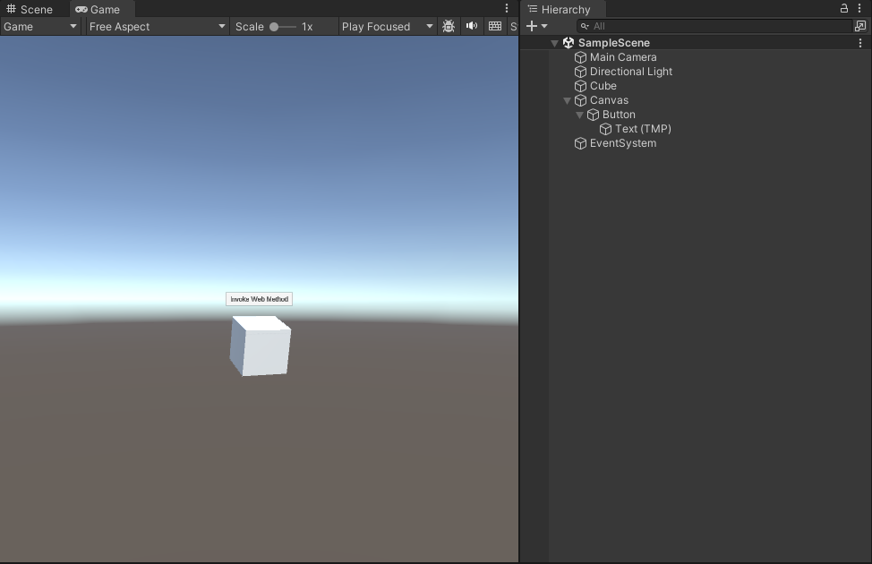
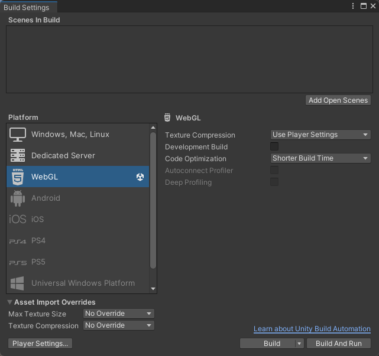
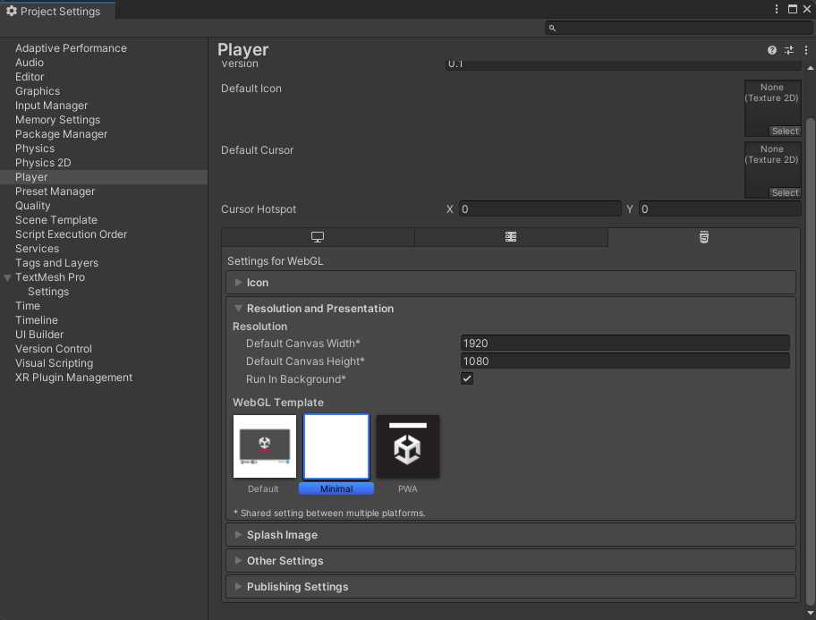
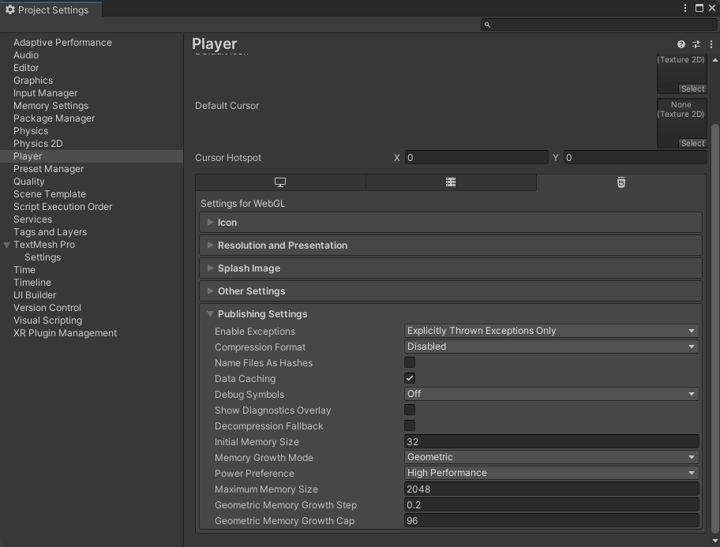
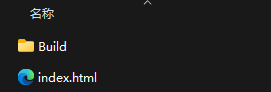

<route lang="yaml">
meta:
  title: Unity 与 Web 数据交互
  desc: 考虑到后面或许会有Unity 与 Web 一同使用的场景，研究了一下 Unity 如何与 Web 进行交互，并记录下来。
  keywords: [Unity, Web, Interact]
  date: 2023-12-06 19:08:07
</route>

# Unity 与 Web 数据交互

考虑到后面或许会有`Unity`与`Web`一同使用的场景，研究了一下 Unity 如何与 Web 进行交互，包含 Unity 调用 Web 方法，Web 调用 Unity 方法。

## 实现方式

1. Unity 端实现一个`jslib`文件预定义函数作为桥接。
2. `C#`脚本使用`DllImport`引入和调用预定义的函数。
3. Web 端使用`createUnityInstance`加载 Unity，然后通过`SendMessage`调用 Unity 端的函数。

## Unity 端实现

### 创建 Unity 项目

Hierarchy 中创建一个`Cube`，和一个`Canvas`，然后在`Canvas`下创建一个`Button`：



### 创建 jslib 文件

在 Unity 项目的`Assets`目录下创建`Plugins`文件夹，然后在`Plugins`文件夹下创建`WebBridge.jslib`文件（名称自定义），代码如下：

```
mergeInto(LibraryManager.library, {
  // 用于接收 Web 端调用的函数
  InvokeWebMethod: function (str) {
    _str = UTF8ToString(str) // 将 c# 字符串 转换为 js 字符串
    WebMethod(_str) // 调用 Web 端定义的函数
  },
})
```

### 创建调用 jslib 的 C# 脚本

在 Unity 项目的`Assets`目录下创建`Scripts`文件夹，然后在`Scripts`文件夹下创建`BtnCtrl.cs`文件，将其挂载到`Button`上，代码如下：

```cs
using UnityEngine;
using UnityEngine.UI;
using System.Runtime.InteropServices;

public class BtnCtrl : MonoBehaviour
{
  void Start()
  {
    GetComponent<Button>().onClick.AddListener(() =>
    {
      InvokeWebMethod("Hello World");
    });
  }

  [DllImport("__Internal")]
  private static extern void InvokeWebMethod(string str);
}
```

### 创建用于 Web 端调用的 C# 脚本

在 Unity 项目的`Assets`目录下创建`Scripts`文件夹，然后在`Scripts`文件夹下创建`CubeCtrl.cs`文件，将其挂载到`Cube`上，代码如下：

```cs
using UnityEngine;

public class CubeCtrl : MonoBehaviour
{
  public void RotateX(float x)
  {
    transform.Rotate(x, 0, 0);
  }
}
```

### 编译项目

在 Unity 项目的`File`菜单中选择`Build Settings`，然后选择`WebGL`，点击`Switch Platform`（我这里已经切换完成了就会显示Build）。



点击左下角的`Player Settings`，在`Resolution and Presentation`中`WebGL Template`选择`Minimal`，在`Publishing Settings`中`Compression Format`选择`Disabled`。





点击`Build`，选择一个目录，等待打包完成，会自动打开目录，我们只需要`Build文件夹`即可，创建canvas自己在Web端完成。



## Web 端实现

固定写法，都是JS在啥框架都一样，下面这是写在vue里面了：

```vue
<template>
  <div full overflow-hidden>
    <canvas id="unity-canvas" style="width: 1920px; height: 1080px;" />
    <button id="btn">
      旋转Cube
    </button>
  </div>
</template>

<script setup lang="ts">
// UnityInstance 用于存储 Unity 实例
let UnityInstance: any = null

// buildUrl 为 Unity 打包后的文件夹路径，我改为了unity，就是上面打包的Build文件夹
const buildUrl = './unity'
const config = {
  dataUrl: `${buildUrl}/Builds.data`,
  frameworkUrl: `${buildUrl}/Builds.framework.js`,
  codeUrl: `${buildUrl}/Builds.wasm`,
  streamingAssetsUrl: 'StreamingAssets',
  companyName: 'DefaultCompany',
  productName: 'WebGL',
  productVersion: '0.1',
}

// 这是 Unity 调用 Web 端的方法，在 jslib 文件中定义的函数
window.WebMethod = function (str: string) {
  alert(str)
}

onMounted(() => {
  // 设置 canvas 的宽高
  const canvas = document.querySelector<HTMLCanvasElement>('#unity-canvas')
  canvas!.style.width = `${window.innerWidth}px`
  canvas!.style.height = `${window.innerHeight}px`
  window.addEventListener('resize', () => {
    canvas!.style.width = `${window.innerWidth}px`
    canvas!.style.height = `${window.innerHeight}px`
  })

  // 加载 Unity
  const script = document.createElement('script')
  script.src = `${buildUrl}/Builds.loader.js`
  document.body.appendChild(script)
  script.onload = () => {
    createUnityInstance(
      canvas,
      config,
      (progress: number) => {
        console.log(`加载中:${progress * 100}%`,)
      }
    )
      .then((unityInstance) => {
        // 加载完成后，将 UnityInstance 赋值给全局变量
        UnityInstance = unityInstance
      })
      .catch((message) => {
        console.log(message)
      })
  }

  // 前端页面向unity页面传值需用到UnityInstance.SendMessage()函数，调用格式如下：
  // SendMessage(unityObject,unityMethodName,value)
  // unityObject——unity脚本挂载对象名
  // unityMethodName——unity脚本内调用方法名（需为public方法）
  // value——前端需要传出的值
  const btn = document.getElementById('btn')
  btn!.onclick = function () {
    UnityInstance.SendMessage('Cube', 'RotateX', 20)
  }
})
</script>
```

## 注意有坑

> 1. 用于接收 Web 端调用的函数必须为`public`，否则会报错。
> 2. 用于 Unity 调用 Web 端的函数必须挂在 UnityInstance 所在的 `window` 上，否则会报错。
> 3. canvas 的style中必须设置`width`和`height`，否则在移动端和Mac（我要是没有Mac还真发现不了了😡）上会出现显示问题。

## 官方文档

https://docs.unity3d.com/cn/2020.3/Manual/webgl-interactingwithbrowserscripting.html

## 最终效果展示

<CustomFrame route="/unity-in-web" />
