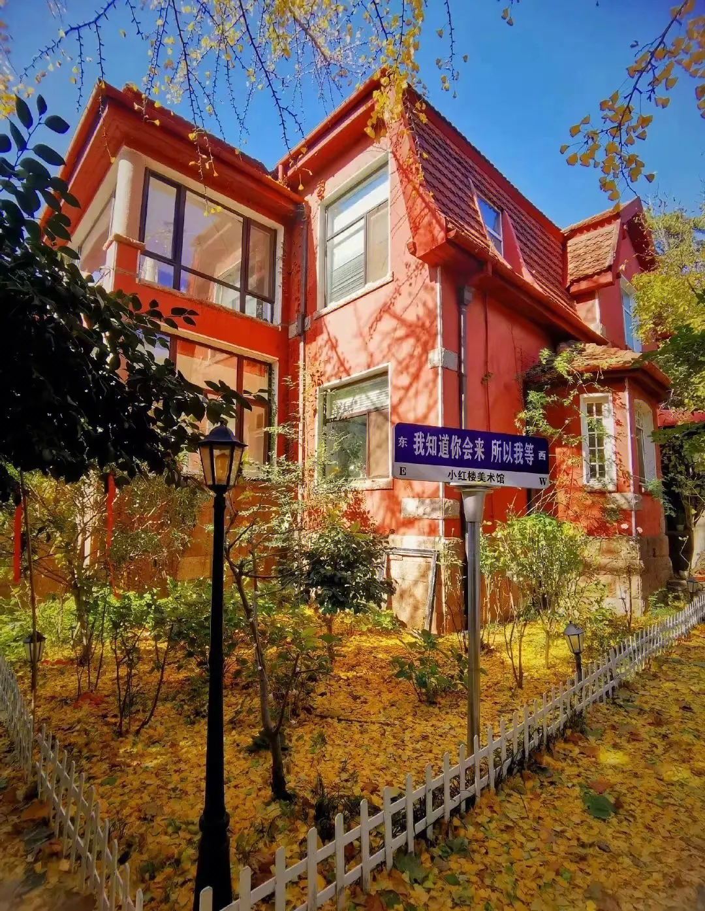
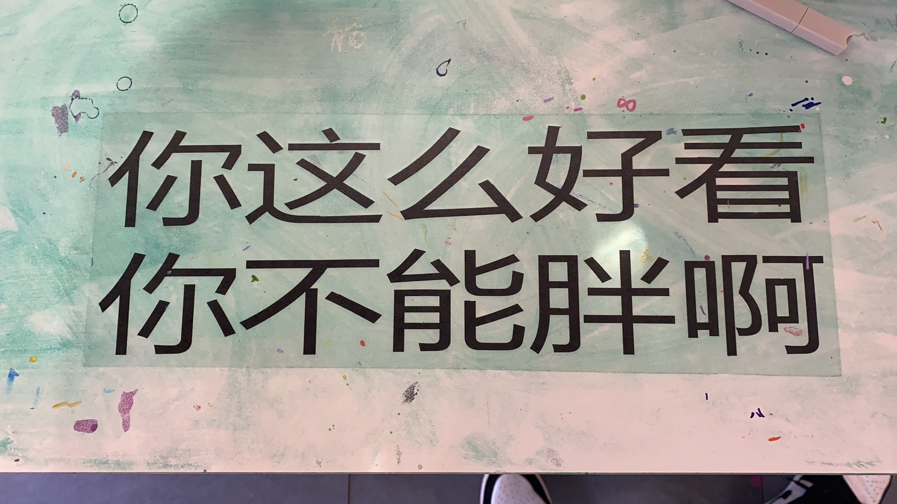
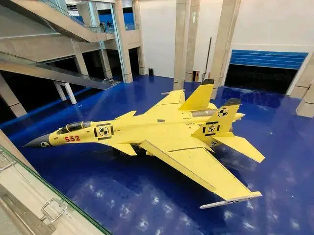
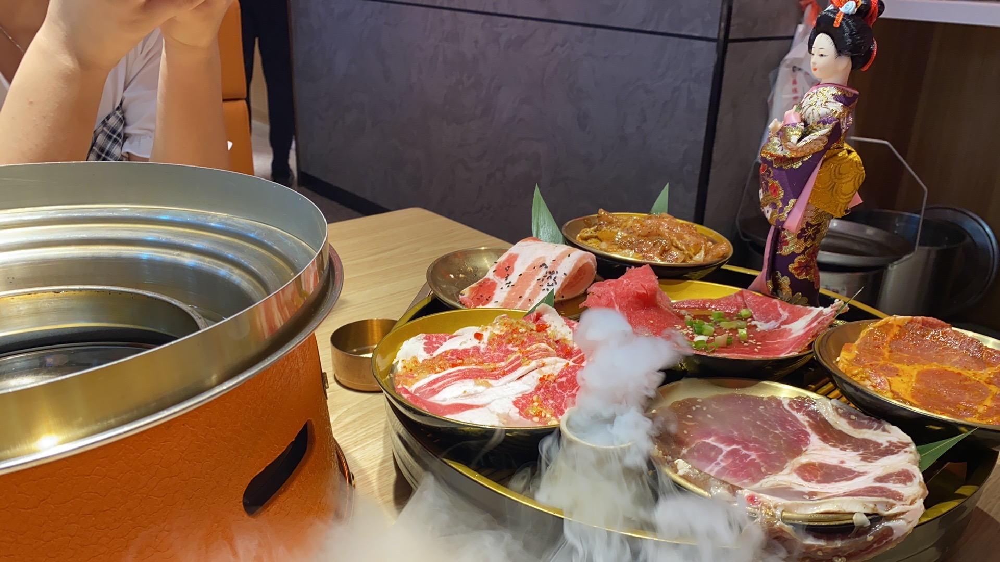
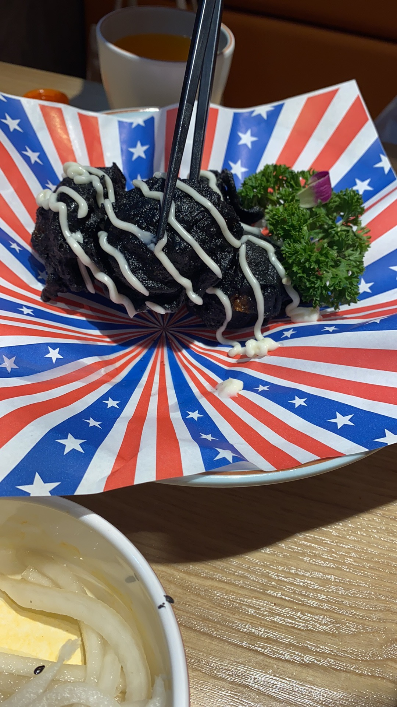
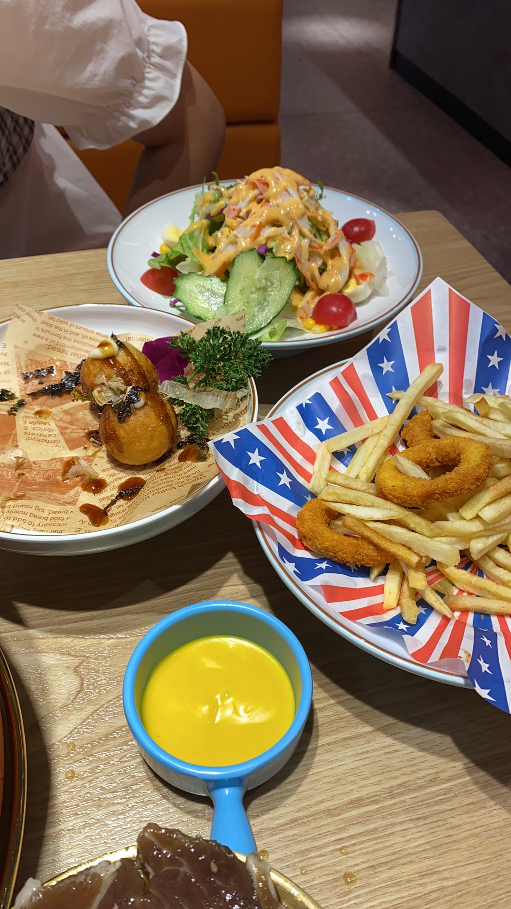
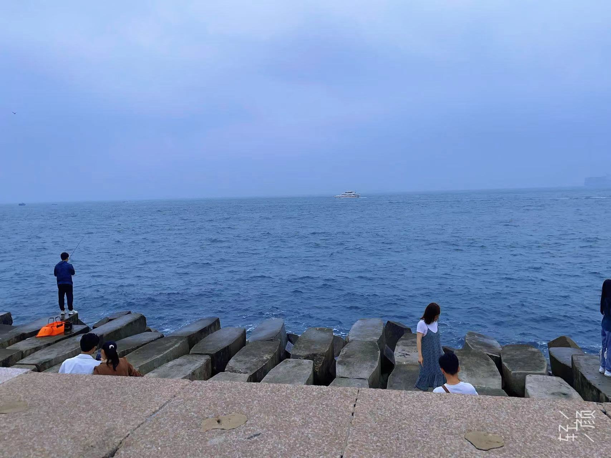
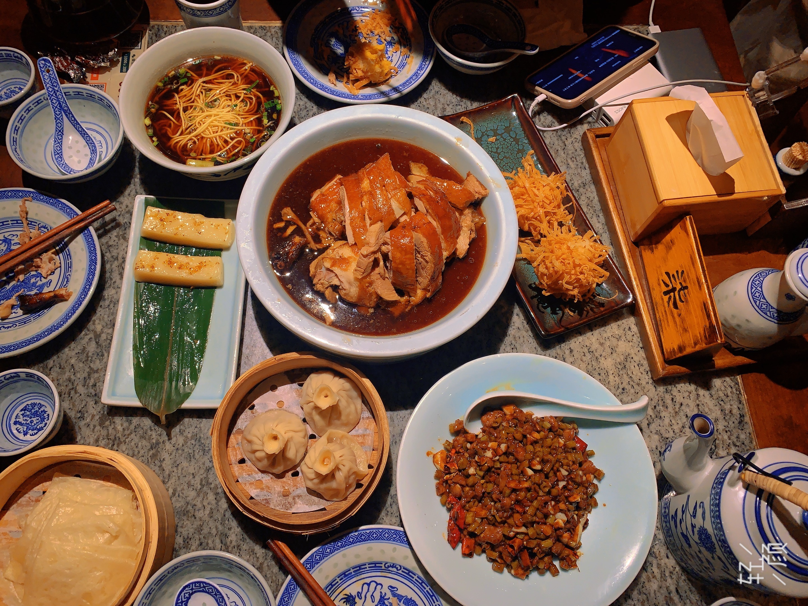
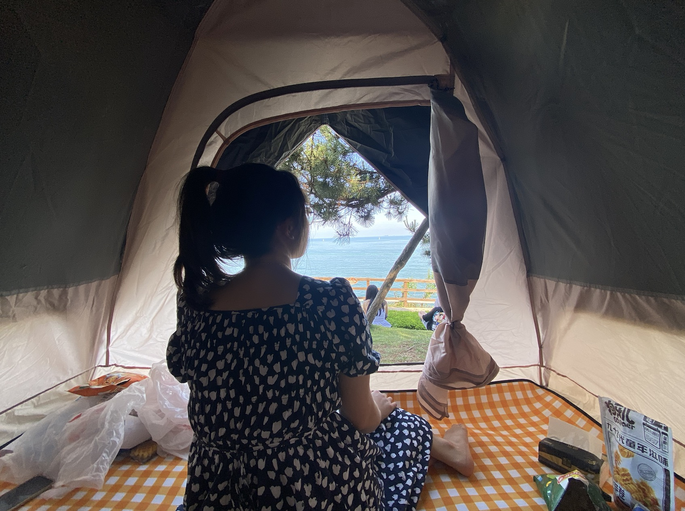

<route lang="yaml">
meta:
  title: 周末两日小游
  desc: 逛了小红楼美术馆🏠，海军博物馆🏛️，吃了烤肉🍖，去了八大峡⛴️，露营燕儿岛🏕️，还去了台东🌃。
  keywords: [生活, 美食, 露营]
  date: 2023-06-18 22:05:20
</route>

# 周末两日小游

小姨子高考结束了，她姐周六值班到下午3点，只能由我带着她来先逛逛了😂。

## 小红楼美术馆 🏠

周六一早来的[小红楼美术馆](https://surl.amap.com/L4GpJ9QcSl)，9.9元的门票🎫，还是挺值的，里面有很多有趣的艺术作品，各种的网红墙，其中就有杰伦的那个「晴天墙」🤩，还有一颗银杏树，待到秋天，应该会很漂亮吧。小姨子还在里面拍了好多好多照片📷，还有我帮她拍的，都在她的手机里，我没有🤪，扒拉个网上的图吧🤣：

拍了一张照片送给了我的Honey🥹：

## 海军博物馆 🏛️

小红楼美术馆逛完了，就去了[海军博物馆](https://surl.amap.com/106F4EiF4MO)，里面有很多的退役的军事装备🔱，还有一些历史的介绍。本了想去驱逐舰🛥️上观光一下的，奈何小姨子恐高，只能在外面看看了😂。

看到网上有人说馆里面有一架歼15🚀，可惜进去看的时候不知道为啥被一块布给遮住了，只能看到一点点🤔，下面是我在网上找到的图片：

## 烤肉 🍖

吆西，终于到了我最爱的环节：干饭😍。在[天主教堂](https://surl.amap.com/5q2L6mSDcWJ)旁边的一家烤肉店吃的，味道还不错，价格也不贵，两个人吃了不到150，吃的很饱🤤。

附图：

## 插曲 🙈

吃完饭，休息了一会，Honey给小姨子订了沪上阿姨🥤，可是门店不能直接扫码，非得让我们从小程序下单使用，可是呀Honey他不会用🫣，气的不行。然后我就亲自上阵了🤗，我从小程序试了试，应该是先选饮料，再去选择对应的卷就可以了🙊。我则是去咖啡店☕️喝了一个咖啡，然后就是等待Honey下班了。

## 八大峡 ⛴️

等到Honey下班了，我们就去了[八大峡](https://surl.amap.com/1bHpbx8fa1w)，是什么电影的取景地🧐，没注意她俩说的是哪部。我感觉就emmmm，就是一个普通的景点吧，没啥特别的🫣，就是有一个台阶可以下到海边，还是一排排整齐的大石块🤪，就像这样：🎹

晚上去[万象城](https://surl.amap.com/1J1PpBFzgiO)的南京大排档吃的饭，味道还不错，没有第一次来的时候好吃😬。

## 燕儿岛 🏕️

周日睡到10点多，起来收拾了一下就去了[燕儿岛](https://surl.amap.com/4vfYusig2oB)，这次是露营🏕️，带了水果、零食、瓜子，还点了一个外卖：绝味鸭脖😋。她俩一来就去下面玩水、捉螃蟹了🦀，我自己在这里欣赏着海景🌊，吃着瓜子🥜，喝着水😂，听着音乐🎵，感觉真的很棒🤩。待到下午5点左右我们就回家了，留了一张Honey欣赏海景的图片：

## 台东 🌃

回到家，整顿了一番就去了[台东](https://surl.amap.com/QlkmaS1t37U)夜市了，吃了：猪蹄🍗、鱿鱼小丸子🦑、铜锣烧🥞、糖球🍡、烤冷面🍜等。

街上有个福利彩票🎟️，小姨子看了老半天，手痒痒的，就买了一张，10元中了20元，还是挺开心的🤣。可是要走的时候，她又想来刮，但是没中，小姨子不服气，就又买了两张，可惜还是没中🤣，到头来还是亏了20元😂。这东西还是不要碰的好，中奖的概率太低了🤪。
