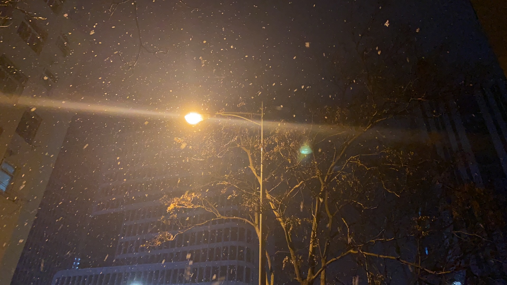

<route lang="yaml">
meta:
  title: 2024年1月生活小记
  desc: 新的一年了，过的好快啊，好想时间能够跑的慢一些。
  keywords: [生活, 记录, 点滴]
  date: 2024-01-31 22:18:39
</route>

# 2024年1月生活小记

新的一年了，过的好快啊，好想时间能够跑的慢一些，这样就能多做一些有意义的事情，做一些有意义的事情。

## 数字人

回公司的第二个月，相对清闲🤪，唯一让人头疼的就是接了个任务，要研究个数字人直播的方案🧐，这个东西真的是太复杂了，一开始讨论玩这个玩意，我就觉得这个东西不好搞🙅，但是领导非要研究一下，我也只能硬着头皮去研究了🙄。

最终啊😧，就是了解了很多东西，然后对接了一些现有的厂商给的测试账号，再就是研究了一下他们的接口文档，最后也没有什么结果，要么就是付费测试，要不就是不理想，最终就先搁置了😑，先进行已有的业务。

## 下雪啦

2024年的第一场雪❄️，下的不大不小，我只能说😑，青岛你终于下了场看得过去的雪了：

## 订婚喽

本月最大的事情就是订婚了，我和我女朋友在一起已经有5年了，终于迈出人生的第一步了，我也是有点小激动的😊，在1月28日也是顺利完成订婚💍。

