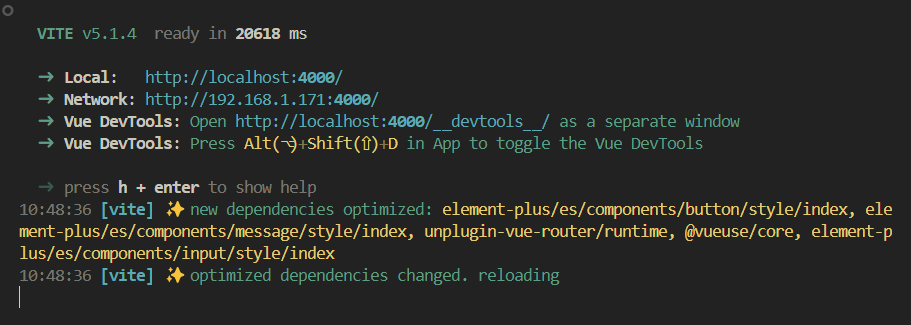

<route lang="yaml">
meta:
  title: vite 动态导入 element
  desc: 使用 element-plus + vite ，使用按需引入的方式，当首次启动 vite 服务时会对 style 进行依赖预构建，并且在切换不同路由时如果其他模块有使用到新的组件，页面会卡住直至 dependencies optimized 完成。
  keywords: [vite, element, plugin]
  date: 2024-02-21 21:04:19
</route>

# vite 动态导入 element

使用`element-plus + vite`按需引入的方式，当`首次启动`vite服务时会对`style`进行依赖预构建，并且在切换不同路由时如果其他模块有使用到新的组件，页面会卡住直至`dependencies optimized`完成：



## 解决方案

> 开发时全量导入`element-plus`组件，打包时按需导入。

## 开发环境完整引入

针对开发环境，我们希望完整引入 element-plus 的所有组件。在 vite.config.js 中通过添加一个自定义插件来实现这个功能：

```ts
import process from 'node:process'
import { defineConfig } from 'vite'

export default defineConfig({
  // ...
  plugins: [
    // ...
    {
      name: 'vite:element-plus-auto-import-in-dev',
      transform(code, id) {
        if (process.env.NODE_ENV === 'development' && /src\/main.ts$/.test(id)) {
          return {
            code: `
              import ElementPlus from 'element-plus';
              import 'element-plus/dist/index.css';
              ${code.split('const app = createApp(App)').join('const app = createApp(App);app.use(ElementPlus);')};
            `,
            map: null,
          }
        }
      },
    },
  ],
})
```

- `transform`: 用于修改代码的钩子函数，返回值是一个对象，包含修改后的代码和 sourcemap。
- `process.env.NODE_ENV`: 用于判断当前是否是开发环境。
- `src/main.ts`: 用于匹配入口文件。
- `code`: 用于修改入口文件的代码，将 ElementPlus 注入到 app 中。
- `map`: 用于 sourcemap，这里不需要 sourcemap，所以设置为 null。
- `split`: 此处是为了避免在`APP.vue`中使用了`el-config-provider`，导致页面比`ElementPlus`加载快,因此需要在`mount`之前引入`ElementPlus`。

在`tsconfig.json`中添加 element-plus 的类型声明：

```json
{
  "compilerOptions": {
    "types": [
      // ...
      "element-plus"
    ]
  }
}
```

## 打包按需引入

在生产环境，我们希望按需引入 element-plus 的组件，这样可以减少打包后的体积，通过配置`unplugin-vue-components`插件来实现这个功能：

```ts
import process from 'node:process'
import { defineConfig } from 'vite'
import Components from 'unplugin-vue-components/vite'
import { ElementPlusResolver } from 'unplugin-vue-components/resolvers'

export default defineConfig({
  // ...
  plugins: [
    // ...
    Components({
      dts: 'src/components.d.ts',
      include: [/\.vue$/, /\.vue\?vue/],
      exclude: ['src/components/**/components/**/*'],
      resolvers: process.env.NODE_ENV === 'production' ? ElementPlusResolver({ importStyle: 'sass' }) : undefined,
    }),
  ],
})
```

> `unplugin-vue-components`的具体配置项可以查看[Github](https://github.com/antfu/unplugin-vue-components)。
> `ElementPlusResolver`具体配置项可以查看[官方文档](https://element-plus.gitee.io/zh-CN/guide/quickstart.html#按需导入)或者[Github](https://github.com/unplugin/unplugin-vue-components)。


## 还需注意

因为这个方案是在开发环境进行全局引入，打包构建后还是保留按需引入。所以在使用 `message` 这类`函数组件`时，需要使用`import { ElMessage } from 'element-plus'`这种手动导入的方式。如果嫌麻烦则可以使用 `unplugin-auto-import` ，并且在 `optimizeDeps` 里对这类反馈组件的样式进行预构建：

```ts
import path from 'node:path'
import { defineConfig } from 'vite'
import AutoImport from 'unplugin-auto-import/vite'

export default defineConfig({
  // ...
  optimizeDeps: {
    include: [
      '@element-plus/icons-vue',
      'element-plus/es',
      'element-plus/es/components/base/style/index',
      'element-plus/es/components/message/style/index',
      'element-plus/es/components/message-box/style/index',
      'element-plus/es/components/notification/style/index',
    ],
  },
  plugins: [
    // ...
    AutoImport({
      imports: [
        'vue',
        'pinia',
        '@vueuse/core',
        VueRouterAutoImports,
        {
          // add any other imports you were relying on
          'vue-router/auto': ['useLink'],
        },
      ],
      resolvers: [ElementPlusResolver({ importStyle: 'sass' })],
      dts: 'src/auto-imports.d.ts',
      dirs: [
        'src/composables',
        'src/events',
        'src/stores',
        'src/utils',
      ],
      vueTemplate: true,
    }),
  ],
})
```
