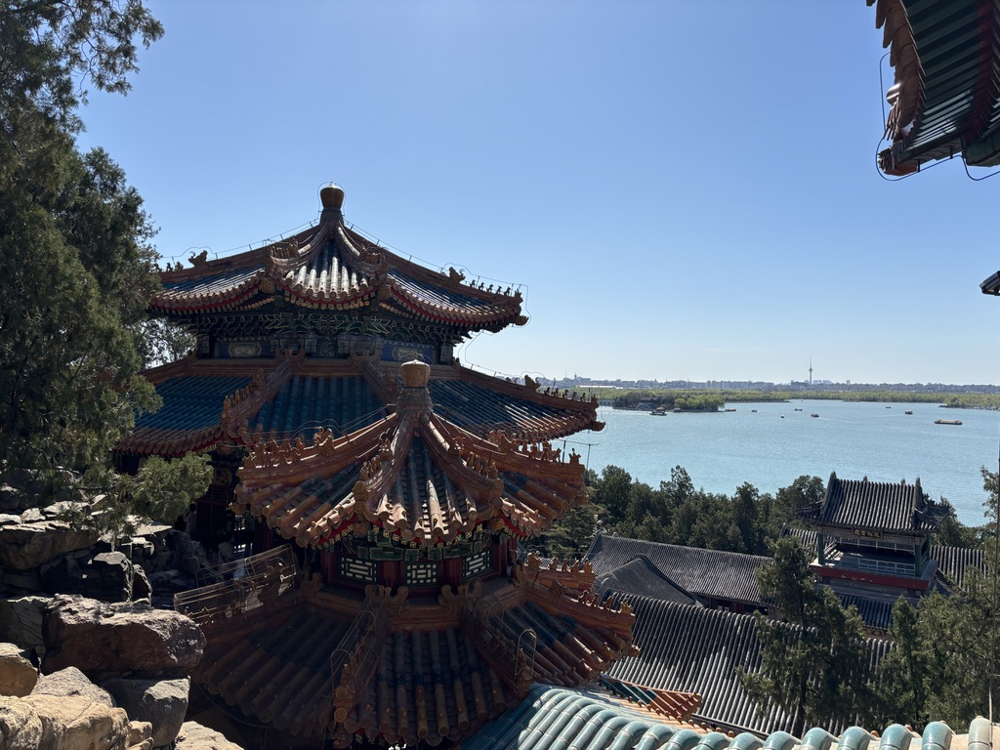

<route lang="yaml">
meta:
  title: 2024年3月生活小记
  desc: 三月，确定了婚期，去北京出了差，游玩了北京的景点，吃了麻辣香锅哈哈哈哈。
  keywords: [生活, 记录, 点滴]
  date: 2024-03-31 18:01:27
</route>

# 2024年3月生活小记

三月，确定了婚期，去北京出了差，游玩了北京的景点，吃了麻辣香锅哈哈哈哈。

## 婚期确定

确定了婚期，是在三月的中旬，我们商量了很久，计划了很久，终于确定了，还是回老家办，希望五月一切顺利😬。

而且还准备参加对象公司的集体婚礼💒，海尔举办的，应该不会差🧐，而且会送一套中式的礼服🤵，还可以住五星级酒店，和豪华自助餐🤩，想想就刺激，只不过是还要请假，Honey到是不用请假，因为她是员工🤪。

## 北京出差

本次出差的目的是学习📖，相关仿真方面的，是一家很强的公司，跟军队走的很近，我很荣幸能去学习。目的地北京🇨🇳，我第一次去北京，足足一周，还是很充实的，学到了很多东西，正好周末可以去北京的景点玩玩，哈哈哈哈😁。

我发现昂，北京的地铁虽然多，但这换乘有点过分啊，走很远才能换乘，而且人也很多，不如我大青岛的地铁换乘舒服，而且很多地铁都没有扶梯，走楼梯很累😮‍💨。

其次，出差期间做过几次公交车，北京公交车上下公交都需要刷卡，我第一次就忘了😭，导致第二次没那么顺利。公交车上还有安全员，小旗子伸出车外摆一摆，就会给公交车让道，还挺有意思的哈哈哈哈哈哈😄。

最喜欢的就是，北京道都有非机动车道，而且非机动车道还有信号灯，很有序，不像青岛，非机动车乱骑乱停，很危险。而且路上好多骑机车的呀，真心羡慕，我也想骑🏍️。

趁着有天下班早，去 “母校” 北大门口，打了个卡📸：

为啥不去另一个母校打卡？因为那个好看的门需要预约哎，我没预约，只能去北大了😅。

## 游玩北京

趁着公司给的机会，可以报销路费，叫上了Honey、姐姐和老妈，我爸愣是不去，没办法了哈哈哈，我们去了颐和园、故宫、景山公园、天安门、天坛、王府井、南锣鼓巷、前门广场，还吃了北京烤鸭。

颐和园很大，老佛爷的园子，她有人抬着我们得走着🤪，时间紧迫，就挑了主要景点，比如清宴舫、画中游、长廊，剩下的有机会再看吧。

清宴舫，有种别样的感觉：

画中游，很有意境：

长廊，老东西了，很有历史感：

故宫，很大，很多人，很宏伟，很多东西，很多历史，很多故事，我的脚也很累😭，不是好不好看，而是历史的韵味，不过总得去一次不是：

出来故宫，就是景山公园，爬上去，可以看到故宫全景，两块钱，还可以：

天安门，不必多说：

晚上，前门广场吃烤鸭，这个得说说，亲娘来，这个烤鸭其实前一天就去了，也去排队了，300多号，我真的会谢，不管是四季民福，还是全聚德，不提前两个小时想都别想，最后只能换一了一家不是很火的店吃的，味道嘛，还是推荐大家来青岛吃菠萝油子、前海沿吃🍽️：

最后就是天坛了，不愧是皇帝祭祀的地方，你永远可以相信古代人的审美：

最后的最后，回来青岛吃了个香锅，好久没吃了，好吃🤤，忘记拍了。
