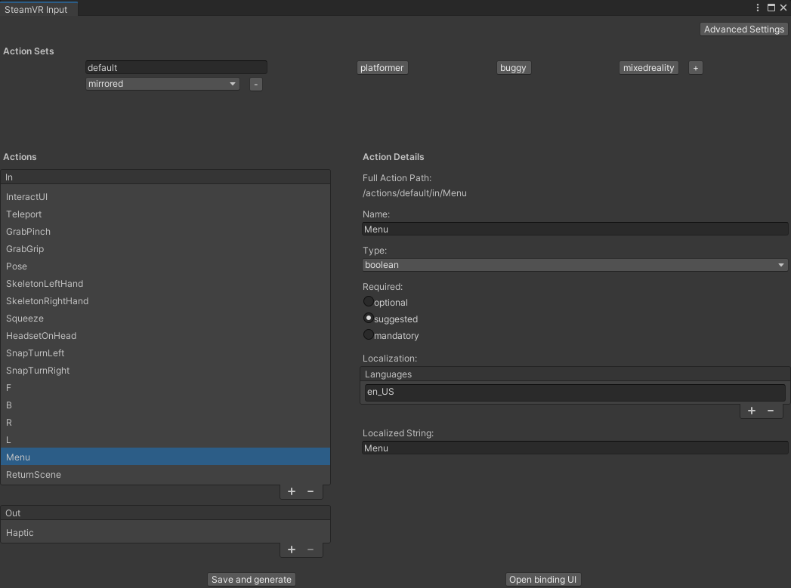
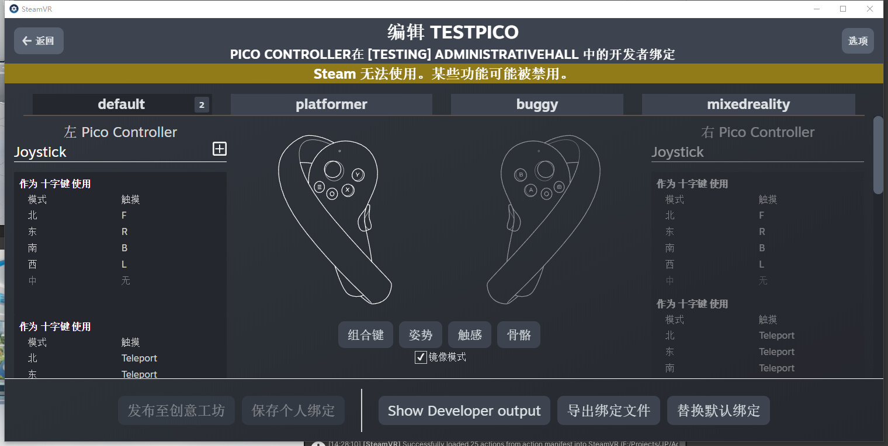

<route lang="yaml">
meta:
  title: VR 随笔
  keywords: [Unity, VR, Informal Essay]
  date: 2023-08-05 22:10:28
</route>

# VR 开发中遇到的问题、解决方案、技巧等

## 1. VR 手柄按键绑定

在 Unity 顶部菜单栏选择 `Window` -> `SteamVR_Input`，打开 SteamVR Input 窗口。

在 `Action` 标签页中，选择 `Create New Action Set`，创建一个新的 Action Set，命名为 `Menu`，点击  `Save and Generate` 保存。



在 SteamVR Input 窗口中，选择 `Open Binding UI`，打开 SteamVR Input 窗口，选择当前项目，进入按键绑定界面。



选择要自定义的按键，点击编辑，找到 `Menu`，最后 `替换默认绑定` 即可，

## 2. 设置游戏中手持手柄

在目录中找到如下预制体：`SteamVR` -> `Prefabs` -> `vr_glove_left_model_slim`，设置绑定脚本中的 `Range Of Motion` 为 `With controller`。

## 3. SteamVR的按钮交互与抓取

### 3.1 Button

- Interactable脚本：`/SteamVR/InteractionSystem/Core/Scripts/Interactable.cs`

- HoverButton脚本：`/SteamVR/InteractionSystem/Core/Scripts/HoverButton.cs`

  此脚本需要一个可进行Hover的对象 `<Moving　Part>`
  该脚本有三个函数调用需要进行脚本编写实现：OnButtonUp、OnButtonDown、OnButtonIsPressed

### 3.1 Throwable

- Interactable脚本：`/SteamVR/InteractionSystem/Core/Scripts/Interactable.cs`

- Throwable脚本：`/SteamVR/InteractionSystem/Core/Scripts/Throwable.cs`

- InteractableHoverEvents脚本：

  `/SteamVR/InteractionSystem/Core/Scripts/InteractableHoverEvents.cs`

  此脚本需要一个可进行Hover的对象 `<Moving　Part>`

  该脚本有四个函数调用需要进行脚本编写实现：OnHandHoverBegin、OnAttachedToHand（Hand　hand）、OnDetachedFromHand（Hand　hand）

  Hand类型来自：using Valve.VR.InteractionSystem;

## 4. 读取Resources文件夹下的json文件

```cs
public class YourType
{
    public string name;
    public List<string> things;
}

// 读取json文件，获取json字符串
string jsonStr = Resources.Load<TextAsset>("fileName").text;
// 将json字符串转换为对象
YourType jsonObj = JsonUtility.FromJson<YourType>(jsonStr);
```

## 5. 打开streamingAssets下的exe程序

```cs
string path = Application.streamingAssetsPath + "/sceneTwo/AdministrativeHall.exe";
Application.OpenURL(path);
```

## 6. VR场景黑屏过渡

在`VR Camera`上添加`SteamVR_Fade`脚本组件，调用`SteamVR_Fade.Start`方法即可。

```cs
using Valve.VR;

// 第一个参数为渐变到的颜色，第二个参数为渐变的时间
SteamVR_Fade.Start(Color.clear, 0); // 渐变到透明
SteamVR_Fade.Start(Color.black, 1f); // 渐变到黑色
```

## 7. VR手柄提示

```cs
// 设置手柄提示
void SetGrabPinchHint(bool isBoth, string text = null)
{
    for (int actionIndex = 0; actionIndex < SteamVR_Input.actionsIn.Length; actionIndex++)
    {
        ISteamVR_Action_In action = SteamVR_Input.actionsIn[actionIndex];
        if (action.GetShortName() == "GrabPinch")
        {
            // 循环Hands,设置手柄提示
            foreach (var hand in Hands)
            {
                if (action.GetActive(hand.handType))
                {
                    hand.TriggerHapticPulse(0);
                    // 判断左右手
                    if (hand.handType == SteamVR_Input_Sources.LeftHand)
                    {
                        // 左手
                        ControllerButtonHints.ShowTextHint(hand, action, text ?? "左手按钮");
                    }
                    else
                    {
                        // 右手
                        ControllerButtonHints.ShowTextHint(hand, action, text ?? "右手按钮");
                    }
                }
            }
            break;
        }
    }
}
```
